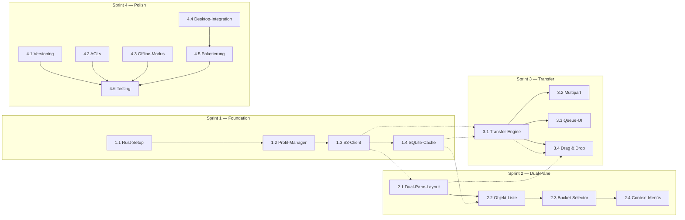

# Sprint Backlog — r2

> **Projekt:** r2 — Nativer S3-kompatibler Object-Storage-Browser für Ubuntu Linux
> **Version:** 1.0
> **Sprints:** 4 × 2 Wochen = 8 Wochen Gesamtlaufzeit
> **Basiert auf:** SRD.md, UX_CONCEPTION.md, TECH_STACK.md, ADR-001–005

---

## Story Point Referenz

| Points | Bedeutung |
|--------|-----------|
| 1 | < 2h, trivial |
| 2 | Halber Tag |
| 3 | ~1 Tag |
| 5 | 2–3 Tage |
| 8 | 3–5 Tage (sollte weiter zerlegt werden) |

## Definition of Done (pro Story)

- [ ] Code compiliert ohne Warnings
- [ ] Unit-Tests geschrieben und grün
- [ ] Integration-Tests (wo anwendbar)
- [ ] Code-Review durchgeführt
- [ ] Dokumentation aktualisiert
- [ ] Feature in .deb getestet

---

## Sprint 1 — Foundation (Woche 1–2)

**Ziel:** Rust-Projekt aufsetzen, GTK4-Hauptfenster, Profil-Manager, S3-Client-Integration, SQLite-Cache

**Gesamt Story Points:** 16

---

### Story 1.1: Rust-Projekt-Setup (3 SP)

**Beschreibung:** Cargo-Workspace mit allen Crates initialisieren, GTK4-Boilerplate (Hauptfenster, Application-Lebenszyklus), Build-Script für cargo-deb.

**Akzeptanzkriterien:**
- [ ] `cargo build` läuft ohne Fehler und Warnings
- [ ] `cargo deb` produziert ein installierbares .deb-Paket
- [ ] App startet und zeigt ein leeres GTK4-Hauptfenster
- [ ] Workspace-Struktur gemäß TECH_STACK.md Abschnitt 4 ist angelegt
- [ ] `Cargo.toml` enthält alle Dependencies aus TECH_STACK.md Abschnitt 3
- [ ] `tracing`-Logging ist initialisiert (JSON-Format)

**Technische Hinweise:**
- Workspace-Crates: `r2-core`, `r2-ui`, `r2-cli` (optional initial)
- GTK4-Application mit `gtk4::Application::new()` und `run()`-Aufruf
- `cargo-deb`-Konfiguration in `Cargo.toml` unter `[package.metadata.deb]`
- Siehe ADR-005 für .deb-Konfiguration

---

### Story 1.2: Profil-Manager (5 SP)

**Beschreibung:** Profil-Erstellung/Editierung/Löschung, libsecret-Integration für Credentials, TOML-basierte Profil-Konfiguration, "Test Connection"-Funktion.

**Akzeptanzkriterien:**
- [ ] Benutzer kann Profile anlegen, bearbeiten, löschen und duplizieren
- [ ] Credentials werden via libsecret gespeichert (NFR-SEC-01)
- [ ] Profile werden in `~/.config/r2/profiles.toml` gespeichert (M-01.03)
- [ ] "Test Connection"-Button führt `ListBuckets` aus und zeigt Erfolg/Fehler
- [ ] Profil-Manager-Dialog entspricht UX_CONCEPTION Abschnitt 2.2
- [ ] Fallback-Mechanismus (AES-256-GCM) wenn libsecret nicht verfügbar (ADR-003)
- [ ] Secret Keys werden nach Verwendung mit `zeroize` überschrieben

**Abhängigkeiten:** Story 1.1 (Rust-Projekt-Setup)

**Technische Hinweise:**
- `CredentialManager` mit `CredentialBackend`-Trait (libsecret + EncryptedFile)
- `secret-service-rs` für D-Bus-Integration
- Profil-Formular-Felder: Name, Endpoint-URL, Access Key, Secret Key, Region, Default-Bucket, Path-Style-Toggle
- Siehe ADR-003 für Credential-Storage-Architektur

---

### Story 1.3: S3-Client-Integration (5 SP)

**Beschreibung:** aws-sdk-s3-Basis-Client mit SigV4, Bucket-Listing, Objekt-Listing (Pagination, Prefix/Delimiter), umfassende Fehlerbehandlung.

**Akzeptanzkriterien:**
- [ ] App listet Buckets von MinIO/Wasabi/Amazon S3 (M-05.02)
- [ ] Objekt-Listing mit Pagination (100 Objekte pro Page) (NFR-PERF-02)
- [ ] Prefix/Delimiter-Navigation funktioniert (Ordner-Struktur)
- [ ] Fehlerbehandlung: Timeout, Auth-Fehler (HTTP 403), Netzwerkfehler, Bucket nicht gefunden (HTTP 404)
- [ ] Path-Style und Virtual-Hosted-Style-URLs konfigurierbar (M-05.04)
- [ ] Unterschiedliche Regionen pro Endpunkt-Profil (M-05.03)
- [ ] `S3Client`-Trait definiert in `r2-core/src/traits.rs`

**Abhängigkeiten:** Story 1.2 (Profil-Manager — für Credentials)

**Technische Hinweise:**
- `aws-sdk-s3` mit Tokio-Runtime
- `S3Client`-Wrapper-Struct mit Konfiguration aus Profil
- `ListBuckets`, `ListObjectsV2` mit `MaxKeys=100`, `Prefix`, `Delimiter`
- Error-Types: `S3Error::Timeout`, `S3Error::AuthFailed`, `S3Error::NetworkError`, `S3Error::NotFound`
- Siehe TECH_STACK.md Abschnitt 2.3 für aws-sdk-s3-Begründung

---

### Story 1.4: SQLite-Cache-Setup (3 SP)

**Beschreibung:** Datenbank-Schema (cached_buckets, cached_objects, transfer_queue, cache_metadata), Write-Ahead-Log-Modus, Basis-CRUD-Operationen.

**Akzeptanzkriterien:**
- [ ] Cache wird bei erfolgreichem List/Refresh automatisch befüllt (S-04.02)
- [ ] Offline-Zugriff auf gecachte Buckets möglich (S-04.03)
- [ ] WAL-Modus aktiviert für bessere Concurrent-Read-Performance
- [ ] Cache-Read < 50ms für 10.000+ gecachte Objekte (NFR-PERF-06)
- [ ] Batch-Upserts für große Buckets (> 1000 Objekte)
- [ ] Cache-Pfad: `~/.config/r2/cache.sqlite`

**Abhängigkeiten:** Story 1.3 (S3-Client — für Cache-Befüllung)

**Technische Hinweise:**
- `rusqlite` mit `bundled`-Feature
- Schema gemäß ADR-004 Abschnitt "Datenbankschema"
- `CacheManager` mit `BucketCache`, `ObjectCache`, `TransferCache`-Submodulen
- Index auf `cached_objects(profile_id, bucket_name, key)` für Prefix-Suche
- Siehe ADR-004 für vollständige Cache-Architektur

---

## Sprint 2 — Dual-Pane-Browser (Woche 3–4)

**Ziel:** Zwei unabhängige Panes, Objekt-Browser, Navigation, Breadcrumbs, Context-Menüs

**Gesamt Story Points:** 16

---

### Story 2.1: Dual-Pane-Layout (5 SP)

**Beschreibung:** GtkPaned mit zwei S3Pane-Widgets, unabhängige Profil/Bucket/Pfad-Auswahl pro Pane, Resize-Griff.

**Akzeptanzkriterien:**
- [ ] Zwei Panes nebeneinander in GtkPaned (M-02.01)
- [ ] Jedes Pane hat eigenen Profil-Dropdown, Bucket-Selector, Pfad-Anzeige (M-02.02)
- [ ] Resize-Griff funktioniert, Doppelklick setzt 50:50 (UX_CONCEPTION 4.5)
- [ ] Pane-Position wird in Config gespeichert und wiederhergestellt
- [ ] Minimale Breite 300px pro Pane
- [ ] Jedes Pane hat eindeutige `PaneId` (Enum: `PaneA`, `PaneB`)

**Abhängigkeiten:** Sprint 1 (Foundation — S3-Client, Cache, Profile)

**Technische Hinweise:**
- `S3Pane` als Custom GTK4 Widget (GtkBox mit Sub-Widgets)
- Pane-Struktur gemäß UX_CONCEPTION Abschnitt 3.1
- SignalBus für Pane↔Pane-Kommunikation (ADR-001)
- `PaneState`-Struct pro Pane (profile_id, bucket_name, current_prefix, etc.)

---

### Story 2.2: Objekt-Liste mit Lazy Loading (5 SP)

**Beschreibung:** GtkColumnView mit virtuellen Zeilen, Spalten (Name, Größe, Typ, Zuletzt geändert, Storage-Class), Sortierung, Lazy Loading.

**Akzeptanzkriterien:**
- [ ] GtkColumnView mit Spalten: Name, Größe, Typ, Zuletzt geändert, Storage-Class
- [ ] Sortierung pro Spalte (klickbarer Spaltenkopf)
- [ ] Lazy Loading: 100 Objekte pro Page, nahtloses Nachladen bei Scroll (NFR-PERF-02)
- [ ] 10.000+ Objekte flüssig browsbar, kein UI-Freeze > 100ms (NFR-PERF-01)
- [ ] Ordner (Prefixes) werden fett dargestellt, Dateien normal
- [ ] Größenanzeige human-readable (KB, MB, GB, TB)
- [ ] Mehrfachauswahl via Strg+Klick / Shift+Klick

**Abhängigkeiten:** Story 2.1 (Dual-Pane-Layout), Story 1.3 (S3-Client), Story 1.4 (Cache)

**Technische Hinweise:**
- `GtkColumnView` + `GtkMultiSelection` für Mehrfachauswahl
- `GtkTreeListModel` für hierarchische Daten
- Lazy Loading via `GtkListItem`-Factory mit Callback für Page-Nachladung
- Sortierung via `GtkSortListModel`
- Siehe UX_CONCEPTION Abschnitt 3.3 für Spalten-Details

---

### Story 2.3: Bucket-Selector und Breadcrumb-Navigation (3 SP)

**Beschreibung:** Dropdown für Bucket-Auswahl, Breadcrumb-Pfad-Navigation, "Up"-Button zum Elternordner.

**Akzeptanzkriterien:**
- [ ] Bucket-Selector (Dropdown) zeigt alle Buckets des aktiven Profils
- [ ] Breadcrumb-Navigation: Bucket > Prefix1 > Prefix2 (klickbar) (M-02.04)
- [ ] "Up"-Button navigiert eine Ebene höher
- [ ] Pfad-Eingabe: Klick wechselt zu editierbarem Entry (M-02.05)
- [ ] Bucket-Liste (Tree-View) links, Objekt-Liste rechts (M-02.03)
- [ ] Alle Loading/Empty/Error-States gemäß UX_CONCEPTION Abschnitt 5.2

**Abhängigkeiten:** Story 2.1 (Dual-Pane-Layout), Story 1.3 (S3-Client)

**Technische Hinweise:**
- `GtkDropDown` für Bucket-Selector
- Breadcrumb als `GtkBox` mit klickbaren `GtkButton`/`GtkLabel`
- Bucket-Tree als `GtkTreeView` in der linken Spalte des Split-View
- Siehe UX_CONCEPTION Abschnitt 3.2 (Bucket-Selector) und 3.4 (Breadcrumb)

---

### Story 2.4: Context-Menüs und Aktionen (3 SP)

**Beschreibung:** Rechtsklick-Menüs für Objekte und Buckets mit allen Aktionen (Download, Delete, Rename, Properties, ACL, Create/Delete Bucket).

**Akzeptanzkriterien:**
- [ ] Rechtsklick auf Objekt(e): Download, Delete, Rename, Copy, Properties (M-03.03–M-03.08)
- [ ] Rechtsklick auf Bucket: Create, Delete, Properties, Versioning, ACL
- [ ] Rechtsklick auf leeren Bereich: Refresh, Upload, New Folder, Select All
- [ ] Bestätigungsdialoge für destruktive Aktionen (NFR-UX-06)
- [ ] Inline-Editing für Rename (F2) gemäß UX_CONCEPTION 4.4
- [ ] Alle Context-Menüs entsprechen UX_CONCEPTION Abschnitt 4.2

**Abhängigkeiten:** Story 2.2 (Objekt-Liste), Story 2.3 (Bucket-Selector)

**Technische Hinweise:**
- `GtkPopoverMenu` für Context-Menüs
- `GtkEventControllerRightClick` für Rechtsklick-Erkennung
- `GtkEditableLabel` oder `GtkEntry`-Overlay für Inline-Editing
- Siehe UX_CONCEPTION Abschnitt 4.2 für vollständige Menü-Strukturen

---

## Sprint 3 — Transfer-Engine (Woche 5–6)

**Ziel:** Upload/Download, Queue, Progress, Pause/Resume, Drag & Drop

**Gesamt Story Points:** 23

---

### Story 3.1: Transfer-Engine (Tokio-basiert) (8 SP)

**Beschreibung:** Async-Tasks für parallele Transfers, PriorityQueue, Progress-Stream, State-Machine, Graceful Shutdown.

**Akzeptanzkriterien:**
- [ ] Parallele Transfers (Default: 4 gleichzeitig, konfigurierbar 1–16) (NFR-PERF-05)
- [ ] Pause/Resume funktioniert pro Transfer (M-04.03)
- [ ] State-Machine: Pending → Active → Paused → Completed/Failed (ADR-002)
- [ ] Graceful Shutdown: laufende Transfers werden pausiert und gespeichert (NFR-REL-03)
- [ ] Automatischer Retry mit exponentiellem Backoff (1s → 2s → 4s → max 30s, 3 Versuche) (NFR-REL-01)
- [ ] Progress-Stream via `broadcast::Sender` für UI-Updates
- [ ] Persistente Queue in SQLite für Resume nach App-Neustart (NFR-REL-02)
- [ ] Prioritätsstufen: Hoch, Normal, Niedrig (S-03.02)

**Abhängigkeiten:** Story 1.3 (S3-Client), Story 1.4 (SQLite-Cache)

**Technische Hinweise:**
- `TransferEngine` mit Tokio-Tasks, `CancellationToken` für Abbruch
- `PriorityQueue<TransferJob>` für Reihenfolge-Steuerung
- `ProgressEvent`-Enum für UI-Kommunikation via `glib::spawn_closure()`
- `tokio::sync::Notify` für effizientes Pause/Resume
- Siehe ADR-002 für vollständige Architektur

---

### Story 3.2: Multipart-Upload/Download (5 SP)

**Beschreibung:** Automatischer Multipart ab 100MB, konfigurierbare Chunk-Größe, parallelisierte Chunk-Uploads, Resume bei abgebrochenen Uploads.

**Akzeptanzkriterien:**
- [ ] Dateien > 100 MB automatisch als Multipart-Upload (M-06.01)
- [ ] Konfigurierbare Part-Größe (Default: 50 MB) (M-06.02)
- [ ] Parallele Chunk-Uploads (max 8 gleichzeitig)
- [ ] Resume bei abgebrochenen Multipart-Uploads (S-05.03)
- [ ] Fortschritt pro Part anzeigbar (M-06.03)
- [ ] 1GB-Datei wird via Multipart hochgeladen
- [ ] Abbruch sendet `AbortMultipartUpload` (NFR-REL-04)

**Abhängigkeiten:** Story 3.1 (Transfer-Engine), Story 1.3 (S3-Client)

**Technische Hinweise:**
- `aws-sdk-s3` Multipart-API: `CreateMultipartUpload`, `UploadPart`, `CompleteMultipartUpload`, `AbortMultipartUpload`
- Part-Status in SQLite persistieren für Resume
- `GetObject` mit `Range`-Header für Multipart-Download
- Siehe SRD M-06 für Multipart-Anforderungen

---

### Story 3.3: Transfer-Queue-UI (5 SP)

**Beschreibung:** Aufklappbares Panel (unten), Tabs (Active/Completed/Failed), Fortschrittsbalken, Speed, ETA, Pause/Resume/Cancel-Buttons.

**Akzeptanzkriterien:**
- [ ] Panel öffnet sich per Slide-In von unten (ca. 200px Höhe)
- [ ] Drei Tabs: "Aktiv" | "Abgeschlossen" | "Fehlgeschlagen"
- [ ] Pro Eintrag: Dateiname, Größe, Quelle→Ziel, Fortschrittsbalken, Speed, ETA
- [ ] Pause/Resume/Cancel-Buttons pro Eintrag
- [ ] Batch-Buttons: "Alle pausierten fortsetzen", "Alle fehlgeschlagenen wiederholen", "Alle abgeschlossenen löschen"
- [ ] Status-Farben: Blau (aktiv), Gelb (pausiert), Grün (completed), Rot (failed)
- [ ] Panel minimierbar, bleibt bei aktiven Transfers sichtbar
- [ ] Entspricht UX_CONCEPTION Abschnitt 2.3 und 3.5

**Abhängigkeiten:** Story 3.1 (Transfer-Engine)

**Technische Hinweise:**
- `GtkListBox` für Transfer-Einträge
- `GtkLevelBar` für Fortschrittsbalken
- `GtkStack` + `GtkStackSwitcher` für Tabs
- Panel als `GtkRevealer` für Slide-In-Animation (300ms ease-out)
- Siehe UX_CONCEPTION Abschnitt 1.7 für Queue-Management-Flow

---

### Story 3.4: Drag & Drop (5 SP)

**Beschreibung:** Pane→Pane (S3→S3-Transfer), Dateimanager→Pane (Lokal→S3-Upload), Pane→Dateimanager (S3→Lokal-Download), Ordner rekursiv.

**Akzeptanzkriterien:**
- [ ] Drag & Drop zwischen Panes startet S3→S3-Transfer (M-04.06)
- [ ] Drag & Drop aus Nautilus/Dolphin startet Upload (M-04.07)
- [ ] Drag & Drop aus Pane in Dateimanager startet Download
- [ ] Ordner rekursiv per Drag & Drop (Struktur-Erhalt)
- [ ] Visuelles Feedback: grüner Rahmen bei gültigem Ziel, roter Cursor bei ungültigem
- [ ] Drag-Overlay zeigt Dateiname(n) + Icon
- [ ] MIME-Type: `application/x-r2-object` für S3-Objekte, `text/uri-list` für Dateimanager

**Abhängigkeiten:** Story 2.1 (Dual-Pane-Layout), Story 3.1 (Transfer-Engine)

**Technische Hinweise:**
- GTK4 `GdkDrag` + `GdkDrop` API
- `GtkDragSource` und `GtkDropTarget` auf Pane-Widgets
- Serialisierung: JSON für `ObjectInfo`-Liste
- Siehe ADR-001 Abschnitt "Drag & Drop-Datenfluss" und UX_CONCEPTION Abschnitt 4.1

---

## Sprint 4 — Polish & Distribution (Woche 7–8)

**Ziel:** Versioning, ACLs, Offline-Modus, Desktop-Integration, Paketierung, Testing & QA

**Gesamt Story Points:** 22

---

### Story 4.1: Versioning (3 SP)

**Beschreibung:** Versionen-Liste anzeigen, Version wiederherstellen, Version löschen, Versions-Status des Buckets anzeigen.

**Akzeptanzkriterien:**
- [ ] Versionierte Buckets zeigen Versions-Historie (S-01.01)
- [ ] Bestimmte Version wiederherstellbar (Copy-to-current) (S-01.02)
- [ ] Einzelne Version löschbar (S-01.03)
- [ ] Versions-Status des Buckets anzeigen: enabled/suspended (S-01.04)
- [ ] Versioning im Bucket-Properties-Dialog umschaltbar

**Abhängigkeiten:** Story 2.4 (Context-Menüs — für Properties-Dialog), Story 1.3 (S3-Client)

**Technische Hinweise:**
- `aws-sdk-s3` Versioning-API: `ListObjectVersions`, `GetObjectVersion`, `DeleteObjectVersion`
- `CopyObject` mit `CopySourceVersionId` für Restore
- Versionen-Liste als separater Dialog oder Tab in Bucket-Properties

---

### Story 4.2: ACL-Management (3 SP)

**Beschreibung:** ACL-Anzeige für Bucket und Objekt, ACL-Editor-Dialog, Grantee-Verwaltung, Canned ACLs.

**Akzeptanzkriterien:**
- [ ] Bucket-ACLs lesen und anzeigen (S-02.01)
- [ ] Objekt-ACLs lesen und anzeigen (S-02.02)
- [ ] ACLs setzen (Canned ACLs: private, public-read, etc.) (S-02.03)
- [ ] ACL-Einträge (Grants) hinzufügen/entfernen (S-02.04)
- [ ] ACL-Editor-Dialog entspricht UX_CONCEPTION Abschnitt 2.4
- [ ] Validierung: Besitzer muss FullControl haben, keine doppelten Grantee-Einträge

**Abhängigkeiten:** Story 2.4 (Context-Menüs), Story 1.3 (S3-Client)

**Technische Hinweise:**
- `aws-sdk-s3` ACL-API: `GetBucketAcl`, `PutBucketAcl`, `GetObjectAcl`, `PutObjectAcl`
- `GtkColumnView` für Grantee-Tabelle
- Siehe UX_CONCEPTION Abschnitt 3.7 für ACL-Editor-Spezifikation

---

### Story 4.3: Offline-Modus (3 SP)

**Beschreibung:** Cache-basiertes Browsing ohne Netzwerk, Sync-Status-Anzeige, manueller Sync-Button, Hintergrund-Sync.

**Akzeptanzkriterien:**
- [ ] App zeigt gecachte Daten ohne Internet (S-04.03)
- [ ] Sync-Status-Anzeige: visualisiert gecached vs. live (S-04.04)
- [ ] Manueller Sync-Button pro Pane
- [ ] Hintergrund-Sync alle 5 Minuten (konfigurierbar)
- [ ] Cache-Invalidierung nach TTL: Buckets 5min, Objekte 30s
- [ ] Offline-Hinweis in Statusleiste: "📡 Offline — Zeige gecachte Daten vom [Datum]"

**Abhängigkeiten:** Story 1.4 (SQLite-Cache), Story 2.1 (Dual-Pane-Layout)

**Technische Hinweise:**
- `SyncManager` mit Hintergrund-Task auf Tokio
- TTL-basierte Invalidierung gemäß ADR-004
- Netzwerk-Status via `tokio::net::TcpStream::connect`-Test oder D-Bus `NetworkManager`
- Siehe ADR-004 für Cache-Invalidierungsstrategie

---

### Story 4.4: Desktop-Integration (3 SP)

**Beschreibung:** .desktop-Datei mit Icon, AppStream-Metadaten, Desktop-Notifications bei Transfer-Fertigstellung, MIME-Type-Registrierung.

**Akzeptanzkriterien:**
- [ ] .desktop-Datei installiert, App erscheint in GNOME Software/KDE Discover
- [ ] AppStream-Metadaten (r2.metainfo.xml) valide
- [ ] Desktop-Notification bei Transfer-Abschluss (via `notify-rust`)
- [ ] App-Icons in allen Größen (16×16 bis scalable SVG)
- [ ] MIME-Type `x-scheme-handler/s3` registriert (optional)

**Abhängigkeiten:** Story 1.1 (Rust-Projekt-Setup — für Build)

**Technische Hinweise:**
- `.desktop`-Datei gemäß ADR-005
- AppStream-Metadaten gemäß ADR-005
- `notify-rust` für D-Bus-Notifications
- Icons in `assets/icons/` mit `hicolor`-Theme-Struktur

---

### Story 4.5: Paketierung (5 SP)

**Beschreibung:** cargo-deb für Ubuntu 22.04/24.04, AppImage-Build, GitHub Actions CI/CD.

**Akzeptanzkriterien:**
- [ ] .deb-Paket wird via `cargo deb` gebaut (Ubuntu 22.04 + 24.04 Varianten)
- [ ] AppImage wird via `appimage-builder` gebaut
- [ ] GitHub Actions CI/CD: Build + Test + Lint + Package + Release
- [ ] CI-Caching via `Swatinem/rust-cache` für schnelle Builds
- [ ] Release-Job: Upload .deb + AppImage als GitHub Release Assets
- [ ] GPG-Signierung für .deb-Pakete

**Abhängigkeiten:** Story 1.1 (Rust-Projekt-Setup), Story 4.4 (Desktop-Integration)

**Technische Hinweise:**
- `cargo-deb` mit Varianten für Ubuntu Jammy (22.04) und Noble (24.04)
- `appimage.yml`-Recipe gemäß ADR-005
- GitHub Actions Workflow gemäß ADR-005
- Siehe ADR-005 für vollständige Build-Pipeline

---

### Story 4.6: Testing & QA (5 SP)

**Beschreibung:** Unit-Tests für Core-Logik, Integration-Tests mit MinIO (Docker), UI-Tests, Code-Coverage.

**Akzeptanzkriterien:**
- [ ] Unit-Tests für Transfer-Engine (State-Machine, Queue, Progress)
- [ ] Unit-Tests für Cache (CRUD, TTL-Invalidierung, Batch-Upserts)
- [ ] Unit-Tests für Credentials (libsecret-Mock, EncryptedFile-Backend)
- [ ] Integration-Tests mit MinIO in Docker (Bucket-Listing, Upload/Download, Multipart)
- [ ] UI-Tests mit gtk4-rs Test-Framework (Pane-Interaktionen, Drag & Drop)
- [ ] > 80% Code-Coverage (gemessen via `cargo tarpaulin` oder `cargo-llvm-cov`)
- [ ] Alle Tests laufen grün in CI

**Abhängigkeiten:** Alle vorherigen Stories

**Technische Hinweise:**
- `rstest` für parametrisierte Tests
- `mockall` für Mocking von S3Client, CredentialBackend
- `tempfile` für temporäre Cache-Datenbanken
- MinIO via `testcontainers`-Crate oder Docker-Compose in CI
- Siehe TECH_STACK.md Abschnitt 4 für Test-Struktur

---

## Sprint-übergreifende Abhängigkeiten

---

## Risiken und Annahmen

| Risiko | Wahrscheinlichkeit | Auswirkung | Mitigation |
|--------|-------------------|------------|------------|
| gtk4-rs API-Inkompatibilitäten | Mittel | Hoch | Frühzeitiges Prototyping in Sprint 1, enge Bindung an stabile Version |
| aws-sdk-s3 Build-Zeit | Hoch | Mittel | CI-Caching, `sccache` für lokale Builds |
| libsecret in CI-Umgebungen | Mittel | Mittel | Fallback auf EncryptedFile-Backend in CI |
| Multipart-Resume-Komplexität | Mittel | Hoch | Frühzeitige Implementierung in Sprint 3, ausgiebige Tests |
| GTK4 Drag & Drop unter Wayland | Niedrig | Hoch | Test auf Wayland ab Sprint 1, Fallback auf X11 |
| AppImage-Größe (> 100 MB) | Mittel | Niedrig | Optimierung der gebündelten Libraries, Kompression |

---

> **Dokumentversion:** 1.0
> **Erstellt:** 11. Mai 2026
> **Basiert auf:** SRD.md v1.0, UX_CONCEPTION.md v1.0, TECH_STACK.md v1.0, ADR-001–005
