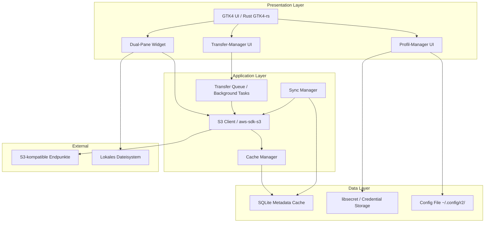
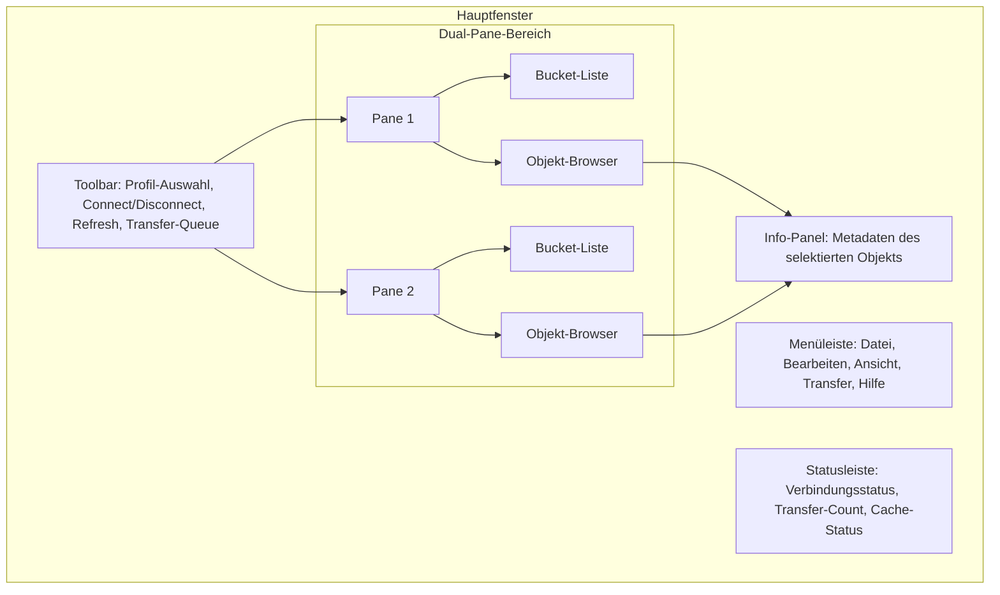
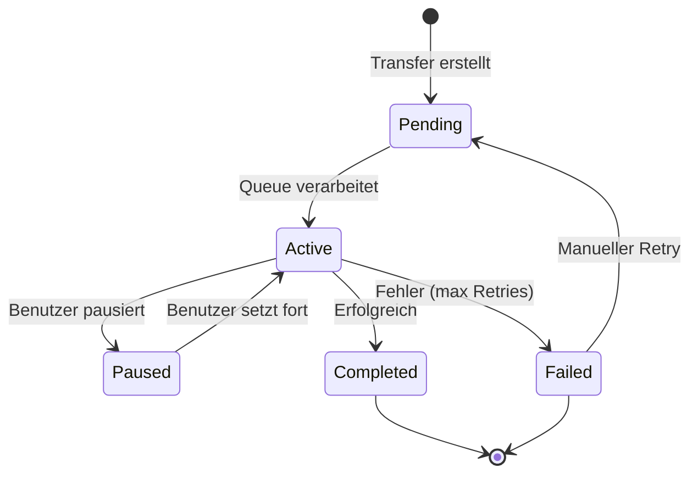

# Software Requirements Document (SRD) — r2

> **Projekt:** r2 — Nativer S3-kompatibler Object-Storage-Browser für Ubuntu Linux
> **Version:** 1.0
> **Status:** Entwurf
> **Sprache:** Deutsch

---

## Inhaltsverzeichnis

1. [Einleitung und Zielsetzung](#1-einleitung-und-zielsetzung)
2. [Zielplattform und Systemvoraussetzungen](#2-zielplattform-und-systemvoraussetzungen)
3. [Architekturüberblick](#3-architekturüberblick)
4. [Funktionale Anforderungen (MoSCoW)](#4-funktionale-anforderungen-moscow)
   - 4.1 [Must-Have (M)](#41-must-have-m)
   - 4.2 [Should-Have (S)](#42-should-have-s)
   - 4.3 [Could-Have (C)](#43-could-have-c)
   - 4.4 [Won't-Have (W) — initial out of scope](#44-wont-have-w--initial-out-of-scope)
5. [Nicht-funktionale Anforderungen](#5-nicht-funktionale-anforderungen)
6. [Benutzeroberfläche (UI/UX)](#6-benutzeroberfläche-uiux)
7. [Datenmodell](#7-datenmodell)
8. [Sicherheitsanforderungen](#8-sicherheitsanforderungen)
9. [Integration und Kompatibilität](#9-integration-und-kompatibilität)
10. [Glossar](#10-glossar)

---

## 1. Einleitung und Zielsetzung

### 1.1 Produktbeschreibung

**r2** ist ein nativer Desktop-Client für Ubuntu Linux, der als grafischer S3-kompatibler Object-Storage-Browser fungiert. Das Produkt richtet sich an Entwickler:innen, DevOps-Ingenieur:innen und Systemadministrator:innen, die regelmäßig mit S3-kompatiblen Speicherdiensten (Amazon S3, MinIO, Wasabi, Ceph, Cloudflare R2 u. a.) arbeiten.

Anders als bestehende Tools (z. B. `aws s3 cli`, `s3cmd`, Cyberduck, FileZilla) liegt der Fokus auf einem **Dual-Pane-Interface** für parallele S3-Endpunkt-Verwaltung und effiziente S3→S3-Transfers.

### 1.2 Kern-Use-Cases

| ID | Use-Case | Beschreibung |
|----|----------|--------------|
| UC-01 | Multi-Endpoint-Verwaltung | Benutzer verwaltet mehrere S3-Endpunkt-Profile mit Credentials |
| UC-02 | Dual-Pane-Browsing | Benutzer sieht zwei S3-Endpunkte (oder S3 + lokal) parallel |
| UC-03 | S3→S3-Transfer | Benutzer transferiert Dateien/Ordner zwischen zwei S3-Endpunkten per Drag & Drop |
| UC-04 | Lokal↔S3-Transfer | Benutzer lädt Dateien hoch/herunter zwischen lokalem Dateisystem und S3 |
| UC-05 | Bucket-Management | Benutzer erstellt, löscht und konfiguriert Buckets |
| UC-06 | Objekt-Management | Benutzer führt CRUD-Operationen auf Objekten durch |
| UC-07 | Transfer-Queue | Benutzer verwaltet parallele Transfers mit Priorisierung und Fortschrittsanzeige |
| UC-08 | Offline-Browsing | Benutzer durchsucht gecachte Bucket-Strukturen ohne Netzwerk |

### 1.3 Zielgruppe

- **Primär:** Entwickler:innen und DevOps-Ingenieur:innen, die täglich mit S3-kompatiblen Speichern arbeiten
- **Sekundär:** Systemadministrator:innen, die S3-Backups verwalten
- **Tertiär:** Technische Projektmanager:innen, die Speicherstrukturen visualisieren möchten

---

## 2. Zielplattform und Systemvoraussetzungen

### 2.1 Zielplattform

| Kriterium | Vorgabe |
|-----------|---------|
| **Betriebssystem** | Ubuntu 22.04 LTS (Jammy) und neuer |
| **Display-Server** | Wayland (primär) und X11 (kompatibel) |
| **Desktop-Umgebung** | GNOME 42+, KDE Plasma 5.24+, beliebige GTK-kompatible Umgebungen |
| **Architektur** | x86_64 (amd64), optional aarch64 |

### 2.2 Systemvoraussetzungen

| Komponente | Minimum | Empfohlen |
|------------|---------|------------|
| **CPU** | 2 Kerne | 4+ Kerne |
| **RAM** | 512 MB | 2 GB |
| **Festplatte** | 200 MB (App + Cache) | 1 GB (bei umfangreichem Cache) |
| **Netzwerk** | Breitband-Internet | Low-Latency-Verbindung zu S3-Endpunkten |
| **Display** | 1280×720 | 1920×1080+ (für Dual-Pane optimal) |

### 2.3 Distribution

- **Primär:** Debian-Paket (.deb) für apt-basierte Systeme
- **Sekundär:** AppImage für distributionunabhängige Nutzung
- **Repository:** Optional PPA oder GitHub Releases

---

## 3. Architekturüberblick

### 3.1 High-Level-Architektur



### 3.2 Technologie-Stack

| Komponente | Technologie | Begründung |
|------------|-------------|------------|
| **Sprache** | Rust | Speichersicherheit, Performance, native Binärgröße |
| **UI-Framework** | GTK4 via `gtk4-rs` | Native Linux-Integration, Wayland-Unterstützung |
| **S3-Client** | `aws-sdk-s3` (Rust) | Vollständige AWS SigV4-Unterstützung, Multipart, Versioning |
| **Async-Runtime** | `tokio` | Notwendig für parallele Transfers und UI-Nebenläufigkeit |
| **Credential Storage** | `libsecret` / `secret-service.rs` | System Keyring, kein Klartext auf Disk |
| **Cache** | SQLite via `rusqlite` | Leichtgewichtig, embedded, zuverlässig |
| **Build-System** | Cargo + `cargo-deb` / `appimage` | Debian-Paketierung, AppImage-Build |
| **Drag & Drop** | GTK4 DnD API | Systemweites Drag & Drop, Wayland-kompatibel |

### 3.3 Architekturprinzipien

1. **Nebenläufigkeit:** UI-Thread blockiert nie — alle S3-Operationen laufen asynchron auf Tokio
2. **Resilienz:** Transfers überleben Netzwerkabbrüche und App-Neustarts (persistente Queue + Resume)
3. **Offline-First:** Metadata-Cache ermöglicht Browsing ohne Netzwerk
4. **Sicherheit:** Credentials verlassen niemals den System Keyring im Klartext
5. **Erweiterbarkeit:** Klare Modulgrenzen für zukünftige Features (Lifecycle-Policies, Events)

---

## 4. Funktionale Anforderungen (MoSCoW)

### 4.1 Must-Have (M)

*Diese Anforderungen sind zwingend für den MVP und definieren den minimalen Funktionsumfang.*

#### M-01: Multi-Endpoint-Profil-Management

| ID | Anforderung | Priorität |
|----|-------------|-----------|
| M-01.01 | Benutzer kann S3-Endpunkt-Profile anlegen, bearbeiten, löschen und duplizieren | Kritisch |
| M-01.02 | Jedes Profil speichert: Endpoint-URL, Access Key, Secret Key, Region, Default-Bucket (optional) | Kritisch |
| M-01.03 | Profile werden in einer Konfigurationsdatei (`~/.config/r2/profiles.toml`) gespeichert | Kritisch |
| M-01.04 | Secret Keys werden ausschließlich über libsecret (Linux Secret Service) gespeichert | Kritisch |
| M-01.05 | Profile können über einen Connect/Disconnect-Schalter aktiviert/deaktiviert werden | Hoch |
| M-01.06 | Verbindungs-Test (ping/ListBuckets) pro Profil vor dem Speichern | Hoch |

#### M-02: Dual-Pane-Browser

| ID | Anforderung | Priorität |
|----|-------------|-----------|
| M-02.01 | Zwei unabhängige Panes nebeneinander, gleich groß oder in der Breite verstellbar | Kritisch |
| M-02.02 | Jedes Pane kann einen beliebigen S3-Endpunkt (auch denselben) oder einen lokalen Ordner laden | Kritisch |
| M-02.03 | Pro Pane: Bucket-Liste (links) + Objekt-Browser (rechts) im klassischen Explorer-Stil | Kritisch |
| M-02.04 | Breadcrumb-Navigation (Bucket > Prefix > Objekt) pro Pane | Hoch |
| M-02.05 | Pfad-Anzeige und manuelle Pfad-Eingabe pro Pane | Hoch |
| M-02.06 | Aktions-Buttons pro Pane: Refresh, Upload, Create Folder | Hoch |

#### M-03: S3-Objekt-Operationen

| ID | Anforderung | Priorität |
|----|-------------|-----------|
| M-03.01 | Bucket erstellen (mit Regionsauswahl) | Kritisch |
| M-03.02 | Bucket löschen (mit Bestätigungsdialog) | Kritisch |
| M-03.03 | Objekte hochladen (Datei-Auswahldialog + Drag & Drop) | Kritisch |
| M-03.04 | Objekte herunterladen (Zielordner-Auswahldialog + Drag & Drop) | Kritisch |
| M-03.05 | Objekte löschen (mit Bestätigung, Mehrfachauswahl) | Kritisch |
| M-03.06 | Objekte umbenennen (Inline-Edit im Tree) | Hoch |
| M-03.07 | Objekte kopieren (S3→S3 innerhalb eines Endpunkts) | Hoch |
| M-03.08 | Objekte verschieben (S3→S3 innerhalb eines Endpunkts) | Hoch |
| M-03.09 | Ordner rekursiv hochladen (Struktur erhalten) | Hoch |
| M-03.10 | Ordner rekursiv herunterladen (Struktur erhalten) | Hoch |
| M-03.11 | Objekt-Head/Metadata anzeigen (Info-Panel) | Hoch |

#### M-04: Transfer-Management (Basis)

| ID | Anforderung | Priorität |
|----|-------------|-----------|
| M-04.01 | Transfers laufen im Hintergrund (non-blocking UI) | Kritisch |
| M-04.02 | Fortschrittsanzeige pro aktivem Transfer: Dateiname, %, Geschwindigkeit, ETA, Bytes | Kritisch |
| M-04.03 | Transfers können pausiert und fortgesetzt werden | Hoch |
| M-04.04 | Mehrere Transfers parallel (konfigurierbare Anzahl, Default: 4) | Hoch |
| M-04.05 | Fehlgeschlagene Transfers werden mit Fehlermeldung angezeigt | Hoch |
| M-04.06 | Drag & Drop zwischen Panes initiiert S3→S3-Transfer | Kritisch |
| M-04.07 | Drag & Drop aus dem Dateimanager (lokal) initiiert Upload | Hoch |

#### M-05: AWS Signature Version 4

| ID | Anforderung | Priorität |
|----|-------------|-----------|
| M-05.01 | Alle S3-API-Aufrufe verwenden AWS SigV4 | Kritisch |
| M-05.02 | Unterstützung für verschiedene S3-kompatible Backends (MinIO, Wasabi, Ceph, Cloudflare R2) | Kritisch |
| M-05.03 | Unterschiedliche Regionen pro Endpunkt-Profil | Kritisch |
| M-05.04 | Path-Style und Virtual-Hosted-Style-URLs konfigurierbar | Hoch |

#### M-06: Multipart-Uploads

| ID | Anforderung | Priorität |
|----|-------------|-----------|
| M-06.01 | Dateien > 100 MB automatisch als Multipart-Upload | Kritisch |
| M-06.02 | Konfigurierbare Part-Größe (Default: 50 MB) | Hoch |
| M-06.03 | Fortschritt pro Part anzeigbar | Hoch |

### 4.2 Should-Have (S)

*Diese Anforderungen sind wichtig, aber nicht zwingend für den MVP. Sie werden in der zweiten Iteration umgesetzt.*

#### S-01: Versioning

| ID | Anforderung | Priorität |
|----|-------------|-----------|
| S-01.01 | Versionen eines Objekts anzeigen (Version-ID, Datum, Größe) | Mittel |
| S-01.02 | Bestimmte Version wiederherstellen (Copy-to-current) | Mittel |
| S-01.03 | Einzelne Version löschen | Mittel |
| S-01.04 | Versions-Status des Buckets anzeigen (enabled/suspended) | Mittel |

#### S-02: ACL-Management

| ID | Anforderung | Priorität |
|----|-------------|-----------|
| S-02.01 | Bucket-ACLs lesen und anzeigen | Mittel |
| S-02.02 | Objekt-ACLs lesen und anzeigen | Mittel |
| S-02.03 | ACLs setzen (Canned ACLs: private, public-read, etc.) | Mittel |
| S-02.04 | ACL-Einträge (Grants) hinzufügen/entfernen | Niedrig |

#### S-03: Transfer-Queue mit Priorisierung

| ID | Anforderung | Priorität |
|----|-------------|-----------|
| S-03.01 | Zentrale Transfer-Queue mit Liste aller aktiven, pausierten, abgeschlossenen und fehlgeschlagenen Transfers | Mittel |
| S-03.02 | Prioritätsstufen: Hoch, Normal, Niedrig | Mittel |
| S-03.03 | Reihenfolge in der Queue per Drag & Drop ändern | Mittel |
| S-03.04 | Batch-Transfers (gesamte Ordner rekursiv) mit Fortschritt pro Datei | Mittel |

#### S-04: Offline-Cache

| ID | Anforderung | Priorität |
|----|-------------|-----------|
| S-04.01 | SQLite-Datenbank für Bucket-Strukturen (Bucket-Liste, Prefixes, Objekt-Metadaten) | Mittel |
| S-04.02 | Cache wird bei erfolgreichem List/Refresh aktualisiert | Mittel |
| S-04.03 | Offline-Browsing: Anzeige der gecachten Struktur ohne Netzwerk | Mittel |
| S-04.04 | Sync-Status-Anzeige: visualisiert, welche Daten gecached vs. live sind | Niedrig |

#### S-05: Resumable Transfers

| ID | Anforderung | Priorität |
|----|-------------|-----------|
| S-05.01 | Bei Netzwerkabbruch: Transfer automatisch fortsetzen (retry mit Backoff) | Mittel |
| S-05.02 | Bei App-Neustart: unvollständige Transfers aus persistenter Queue fortsetzen | Mittel |
| S-05.03 | Multipart-Uploads: unvollständige Parts erkennen und fortsetzen | Mittel |

### 4.3 Could-Have (C)

*Diese Anforderungen sind wünschenswert, aber optional. Sie werden nur umgesetzt, wenn Zeit und Ressourcen es erlauben.*

#### C-01: Erweiterte UI-Features

| ID | Anforderung | Priorität |
|----|-------------|-----------|
| C-01.01 | Dunkles Theme / System-Theme-Erkennung | Niedrig |
| C-01.02 | Tastaturkürzel (Shortcuts) für alle Aktionen | Niedrig |
| C-01.03 | Tabbed Panes (mehrere Tabs pro Pane) | Niedrig |
| C-01.04 | Such-/Filter-Funktion in der Objekt-Liste (clientseitig) | Niedrig |
| C-01.05 | Spalten-Konfiguration (welche Spalten angezeigt werden) | Niedrig |
| C-01.06 | Lesezeichen (Favorites) für häufig genutzte Pfade | Niedrig |

#### C-02: Erweiterte S3-Features

| ID | Anforderung | Priorität |
|----|-------------|-----------|
| C-02.01 | Bucket-Policy-Anzeige (read-only) | Niedrig |
| C-02.02 | CORS-Konfiguration anzeigen (read-only) | Niedrig |
| C-02.03 | Lifecycle-Regeln anzeigen (read-only) | Niedrig |
| C-02.04 | Storage-Class beim Upload wählbar | Niedrig |
| C-02.05 | Server-side Encryption-Einstellungen (SSE-S3, SSE-KMS) | Niedrig |
| C-02.06 | Objekt-Tags anzeigen und bearbeiten | Niedrig |
| C-02.07 | Presigned-URL generieren (mit Ablaufzeit) | Niedrig |

#### C-03: Transfer-Erweiterungen

| ID | Anforderung | Priorität |
|----|-------------|-----------|
| C-03.01 | Transfer-Geschwindigkeit begrenzen (Bandbreiten-Limit) | Niedrig |
| C-03.02 | Zeitplan für Transfers (z. B. "nach 22 Uhr starten") | Niedrig |
| C-03.03 | E-Mail-/Desktop-Benachrichtigung bei Transfer-Abschluss | Niedrig |
| C-03.04 | Checksum-Verifikation nach Transfer (ETag/MD5) | Niedrig |
| C-03.05 | Transfer-Historie (Log aller abgeschlossenen Transfers) | Niedrig |

#### C-04: Integrationen

| ID | Anforderung | Priorität |
|----|-------------|-----------|
| C-04.01 | CLI-Modus (Headless-Operationen via `r2 cp`, `r2 ls`, etc.) | Niedrig |
| C-04.02 | Export/Import von Profilen (verschlüsselt) | Niedrig |
| C-04.03 | System Tray Icon mit Schnellzugriff | Niedrig |
| C-04.04 | Integration mit `xdg-open` für Objekt-URLs | Niedrig |

### 4.4 Won't-Have (W) — initial out of scope

*Diese Anforderungen sind explizit nicht Teil des initialen Produkts und werden auf absehbare Zeit nicht umgesetzt.*

| ID | Anforderung | Begründung |
|----|-------------|------------|
| W-01 | S3-Event-Notifications / Bucket-Trigger | Komplexität zu hoch für MVP; erfordert SNS/SQS-Integration |
| W-02 | Lifecycle-Policy-Editor (nur read-only in C-02.03) | Policy-Editierung erfordert Validierungslogik; read-only reicht initial |
| W-03 | Replikations-Regeln (CRR/SRR) | Nur über AWS Console sinnvoll konfigurierbar |
| W-04 | S3-Select / SQL-Queries | Erfordert Query-Engine; separater Use-Case |
| W-05 | Multi-Region-Replication | AWS-Infrastruktur-Feature, kein Client-Use-Case |
| W-06 | S3 Batch Operations | AWS-eigenes Feature; keine Client-API |
| W-07 | Object-Lock / Legal Hold | Spezialfall; initial nicht benötigt |
| W-08 | S3 Inventory / Analytics | Reporting-Feature; kein Client-Use-Case |
| W-09 | Windows/macOS-Portierung | Fokus auf Ubuntu Linux; Portierung später evaluierbar |
| W-10 | WebDAV-/FTP-Protokoll-Unterstützung | Reiner S3-Client; keine Multi-Protokoll-Unterstützung |

---

## 5. Nicht-funktionale Anforderungen

### 5.1 Performance (NFR-PERF)

| ID | Anforderung | Messkriterium |
|----|-------------|---------------|
| NFR-PERF-01 | UI bleibt reaktionsfähig bei 10.000+ Objekten pro Bucket | Kein UI-Freeze > 100ms bei List-Operationen |
| NFR-PERF-02 | Lazy Loading: Objekt-Liste lädt in Pages (Default: 100 Objekte pro Page) | Scrollen löst nahtlos nächste Page |
| NFR-PERF-03 | App-Startzeit < 2 Sekunden (inkl. Profil-Ladung) | Gemessen auf empfohlener Hardware |
| NFR-PERF-04 | Bucket-Listing < 1 Sekunde bei < 100 Buckets | Netzwerklatenz ausgenommen |
| NFR-PERF-05 | Parallele Transfers nutzen volle Bandbreite (konfigurierbar 1–16 parallele Streams) | Kein künstlicher Flaschenhals durch App |
| NFR-PERF-06 | Cache-Read < 50ms für 10.000+ gecachte Objekte | SQLite-Query-Optimierung |

### 5.2 Sicherheit (NFR-SEC)

| ID | Anforderung | Umsetzung |
|----|-------------|-----------|
| NFR-SEC-01 | Credentials niemals im Klartext auf der Festplatte | libsecret / Linux Secret Service |
| NFR-SEC-02 | Secret Key nur im Arbeitsspeicher entschlüsselt | Entschlüsselung bei Connect, Freigabe bei Disconnect |
| NFR-SEC-03 | Keine Credentials in Logs, Core-Dumps oder Crash-Reports | Sensitive-Daten-Filter in Log-Layer |
| NFR-SEC-04 | TLS/HTTPS für alle S3-API-Aufrufe (Ausnahme: lokales MinIO ohne TLS konfigurierbar) | Erzwungen durch aws-sdk-s3 Default |
| NFR-SEC-05 | Sicheres Löschen von Credentials beim Profil-Löschen | libsecret-Item entfernen |
| NFR-SEC-06 | Keine Hardcoded Credentials im Binary | Nur Konfiguration via Profil-Manager |

### 5.3 Stabilität und Zuverlässigkeit (NFR-REL)

| ID | Anforderung | Umsetzung |
|----|-------------|-----------|
| NFR-REL-01 | Transfers überleben Netzwerkabbrüche (automatischer Retry mit exponentiellen Backoff) | Retry-Logic in Transfer-Queue |
| NFR-REL-02 | App-Crash während Transfers: unvollständige Transfers sind nach Neustart fortsetzbar | Persistente Transfer-Queue (SQLite) |
| NFR-REL-03 | Graceful Shutdown: laufende Transfers werden vor App-Beendigung pausiert und gespeichert | Signal-Handler (SIGTERM, SIGINT) |
| NFR-REL-04 | Kein Datenverlust bei abgebrochenen Uploads (abgeschlossene Parts bleiben erhalten) | Multipart-Abbrechen (AbortMultipartUpload) bei Abbruch |
| NFR-REL-05 | Maximal 5% Absturzrate unter Normalbedingungen | Stabilitäts-Monitoring via Crash-Reporting |

### 5.4 Benutzbarkeit (NFR-UX)

| ID | Anforderung | Umsetzung |
|----|-------------|-----------|
| NFR-UX-01 | UI-Sprache: Deutsch (vollständig) | i18n mit gettext / Rust `tr`-Crate |
| NFR-UX-02 | Konsistentes Layout: Dual-Pane mit einheitlicher Toolbar | GTK4 Grid/Box-Layout |
| NFR-UX-03 | Alle Aktionen sind auch per Tastatur erreichbar | Shortcuts dokumentiert in Menü |
| NFR-UX-04 | Fortschrittsbalken und ETA für alle Transfers > 1 Sekunde | Transfer-Queue-UI |
| NFR-UX-05 | Fehlermeldungen in verständlichem Deutsch (keine Roh-Exceptions) | Error-Handling-Layer mit User-facing Messages |
| NFR-UX-06 | Bestätigungsdialoge für destruktive Aktionen (Löschen, Überschreiben) | Modal-Dialoge |

### 5.5 Wartbarkeit (NFR-MAINT)

| ID | Anforderung | Umsetzung |
|----|-------------|-----------|
| NFR-MAINT-01 | Modularer Code: S3-Client, Cache, UI, Transfer-Queue als getrennte Crates | Rust Workspace mit Sub-Crates |
| NFR-MAINT-02 | Automatisierte Tests: Unit-Tests + Integration-Tests | `cargo test` mit Mock-S3-Server |
| NFR-MAINT-03 | CI/CD: GitHub Actions für Build, Test, Lint, Package | `.github/workflows/` |
| NFR-MAINT-04 | Logging: Strukturierte Logs (JSON) für Debugging | `tracing`-Crate |
| NFR-MAINT-05 | Dokumentation: Architektur-Entscheidungen in ADRs | `/docs/adr/` |

### 5.6 Kompatibilität (NFR-COMPAT)

| ID | Anforderung | Umsetzung |
|----|-------------|-----------|
| NFR-COMPAT-01 | Wayland + X11 voll kompatibel | GTK4 native Wayland-Unterstützung |
| NFR-COMPAT-02 | S3-kompatible Backends: MinIO, Wasabi, Ceph, Cloudflare R2, DigitalOcean Spaces | AWS SigV4 + konfigurierbare Endpunkte |
| NFR-COMPAT-03 | Ubuntu 22.04 LTS, 24.04 LTS | .deb-Paket mit richtigen Dependencies |
| NFR-COMPAT-04 | System Drag & Drop (Dateimanager → App, App → Dateimanager) | GTK4 DnD API |
| NFR-COMPAT-05 | Desktop-Notifications via D-Bus | `notify-rust`-Crate |

### 5.7 Ressourcenverbrauch (NFR-RES)

| ID | Anforderung | Grenzwert |
|----|-------------|-----------|
| NFR-RES-01 | RAM-Verbrauch im Leerlauf < 150 MB | Gemessen ohne aktive Transfers |
| NFR-RES-02 | RAM-Verbrauch bei aktivem Transfer < 500 MB (zzgl. Transfer-Puffer) | 4 parallele Transfers, 50 MB Part-Größe |
| NFR-RES-03 | CPU-Auslastung im Leerlauf < 1% | Keine Polling-Loops |
| NFR-RES-04 | Cache-Datenbank < 500 MB bei 100.000 gecachten Objekten | SQLite-Kompression, evtl. Vakuum |

---

## 6. Benutzeroberfläche (UI/UX)

### 6.1 Hauptfenster-Layout



### 6.2 Pane-Struktur (Detail)

Jedes Pane besteht aus:

1. **Pane-Header:** Profil-Name, Bucket-Selector (Dropdown), Connect/Disconnect-Button
2. **Breadcrumb-Navigation:** Bucket > Prefix1 > Prefix2 (klickbar)
3. **Split-View:**
   - **Links (schmal):** Bucket-Liste / Prefix-Baum (Tree-View)
   - **Rechts (breit):** Objekt-Liste (TableView mit Spalten: Name, Größe, Typ, Zuletzt geändert, Storage-Class)
4. **Pane-Footer:** Anzahl Objekte, Gesamtgröße (optional)

### 6.3 Transfer-Queue-Dialog

- Aufrufbar über Toolbar-Button oder Menü
- Liste aller Transfers mit Status (Aktiv, Pausiert, Abgeschlossen, Fehlgeschlagen)
- Pro Transfer: Dateiname, Quelle → Ziel, Fortschritt (Bar + %), Geschwindigkeit, ETA
- Buttons: Pause/Resume, Cancel, Clear Completed
- Prioritäts-Spalte mit Drag-to-Reorder

### 6.4 Profil-Manager-Dialog

- Liste aller gespeicherten Profile
- Neu / Bearbeiten / Löschen / Duplizieren
- Profil-Formular: Name, Endpoint-URL, Access Key, Secret Key, Region, Default-Bucket, Path-Style-Toggle
- "Test Connection"-Button
- Export/Import (verschlüsselt) — Could-Have

### 6.5 Drag & Drop-Interaktionen

| Aktion | Quelle | Ziel | Ergebnis |
|--------|--------|------|----------|
| Objekt(e) zwischen Panes | Pane A (S3) | Pane B (S3) | S3→S3-Transfer |
| Datei(en) aus Dateimanager | Nautilus/Dolphin | Pane (S3) | Upload zu S3 |
| Objekt(e) aus Pane | Pane (S3) | Dateimanager | Download |
| Objekt(e) in Pane | Pane (S3) | Selbes Pane, anderer Prefix | S3→S3-Kopie |
| Objekt(e) in Pane mit Mod-Taste | Pane (S3) | Selbes Pane, anderer Prefix | S3→S3-Verschiebung |

---

## 7. Datenmodell

### 7.1 Konfigurationsdatei: `~/.config/r2/profiles.toml`

```toml
# Beispiel: profiles.toml
[profiles.production]
endpoint = "https://s3.eu-central-1.amazonaws.com"
region = "eu-central-1"
default_bucket = "my-app-data"
path_style = false

[profiles.minio-local]
endpoint = "http://localhost:9000"
region = "us-east-1"
default_bucket = ""
path_style = true
```

> **Hinweis:** `access_key` und `secret_key` sind NICHT in dieser Datei enthalten. Sie werden via libsecret gespeichert und über die Profil-ID referenziert.

### 7.2 Credential Storage (libsecret)

```
Schema: com.r2.s3-credentials
Attribute:
  - profile_id: string (UUID)
  - profile_name: string
Secret: JSON { access_key: "...", secret_key: "..." }
```

### 7.3 SQLite-Cache-Schema

```sql
-- Tabelle: cached_buckets
CREATE TABLE cached_buckets (
    id INTEGER PRIMARY KEY AUTOINCREMENT,
    profile_id TEXT NOT NULL,
    bucket_name TEXT NOT NULL,
    creation_date TEXT,
    region TEXT,
    versioning_status TEXT, -- "Enabled", "Suspended", NULL
    cached_at TEXT NOT NULL DEFAULT (datetime('now')),
    UNIQUE(profile_id, bucket_name)
);

-- Tabelle: cached_objects
CREATE TABLE cached_objects (
    id INTEGER PRIMARY KEY AUTOINCREMENT,
    profile_id TEXT NOT NULL,
    bucket_name TEXT NOT NULL,
    key TEXT NOT NULL,
    size INTEGER,
    etag TEXT,
    storage_class TEXT,
    last_modified TEXT,
    content_type TEXT,
    is_prefix BOOLEAN NOT NULL DEFAULT 0,
    cached_at TEXT NOT NULL DEFAULT (datetime('now')),
    UNIQUE(profile_id, bucket_name, key)
);

-- Index für schnelle Prefix-Suche
CREATE INDEX idx_objects_prefix ON cached_objects(profile_id, bucket_name, key);

-- Tabelle: transfer_queue (persistente Queue)
CREATE TABLE transfer_queue (
    id INTEGER PRIMARY KEY AUTOINCREMENT,
    source_profile_id TEXT,
    source_bucket TEXT,
    source_key TEXT,
    dest_profile_id TEXT,
    dest_bucket TEXT,
    dest_key TEXT,
    direction TEXT NOT NULL, -- "s3_to_s3", "local_to_s3", "s3_to_local"
    total_bytes INTEGER,
    transferred_bytes INTEGER DEFAULT 0,
    status TEXT NOT NULL DEFAULT 'pending', -- "pending", "active", "paused", "completed", "failed"
    priority INTEGER DEFAULT 0,
    error_message TEXT,
    created_at TEXT NOT NULL DEFAULT (datetime('now')),
    updated_at TEXT NOT NULL DEFAULT (datetime('now'))
);
```

### 7.4 Transfer-Queue (In-Memory + Persistenz)



---

## 8. Sicherheitsanforderungen

### 8.1 Credential-Handling

| Aspekt | Umsetzung |
|--------|-----------|
| **Speicherung** | libsecret (Linux Secret Service / GNOME Keyring / KDE Wallet) |
| **Transport** | Secret Key nur im Arbeitsspeicher; niemals auf Disk geschrieben |
| **Lebenszyklus** | Entschlüsselung bei Connect, Freigabe/Fortschreiben bei Disconnect/Profil-Löschung |
| **Backup** | Profile ohne Secret Keys exportierbar; Secrets müssen manuell neu eingegeben werden |
| **Isolation** | Jedes Profil hat eigene libsecret-Item-ID; keine Vermischung |

### 8.2 Netzwerksicherheit

| Aspekt | Umsetzung |
|--------|-----------|
| **TLS** | HTTPS für alle S3-API-Aufrufe (Ausnahme: lokale Dev-Endpunkte ohne TLS konfigurierbar) |
| **Zertifikatsprüfung** | Standard-OS-CA-Trust-Store; keine unsicheren Ciphers |
| **Zeitsynchronisation** | SigV4 erfordert korrekte Systemzeit; Hinweis bei Zeitabweichung > 5 Minuten |

### 8.3 App-Sicherheit

| Aspekt | Umsetzung |
|--------|-----------|
| **Sandboxing** | Kein Sandboxing initial; AppImage/Snap-Option später evaluierbar |
| **Update-Mechanismus** | Signaturen für .deb-Pakete (GPG); AppImage-Updates via AppImageUpdate |
| **Crash-Reporting** | Optional; keine Credentials in Crash-Reports (Filter-Layer) |
| **Logging** | Keine Secrets in Logs; Log-Level konfigurierbar (debug, info, warn, error) |

---

## 9. Integration und Kompatibilität

### 9.1 S3-kompatible Backends

| Backend | Status | Besonderheiten |
|---------|--------|----------------|
| **Amazon S3** | Voll unterstützt | Standard-SigV4, alle Regionen |
| **MinIO** | Voll unterstützt | Path-Style erforderlich, oft ohne TLS |
| **Wasabi** | Voll unterstützt | Andere Endpunkt-URL-Struktur, SigV4 |
| **Ceph (RADOS Gateway)** | Voll unterstützt | Path-Style, konfigurierbar |
| **Cloudflare R2** | Voll unterstützt | Keine Egress-Gebühren, SigV4 |
| **DigitalOcean Spaces** | Voll unterstützt | Abweichende Endpunkt-URLs |
| **Backblaze B2** | S3-kompatibler Modus | Über S3-kompatible API-Schicht |
| **Scaleway Object Storage** | Voll unterstützt | Standard-SigV4 |
| **OVHcloud Object Storage** | Voll unterstützt | Standard-SigV4 |
| **Alibaba Cloud OSS** | S3-kompatibler Modus | Abweichende Signatur in einigen Regionen |

### 9.2 Systemintegration

| Integration | Technologie | Beschreibung |
|-------------|-------------|--------------|
| **Dateimanager (Nautilus/Dolphin)** | GTK4 DnD | Drag & Drop von lokalen Dateien in die App |
| **Desktop-Notifications** | D-Bus / `notify-rust` | Benachrichtigung bei Transfer-Abschluss/-Fehler |
| **System Tray** | GTK4 StatusIcon | Minimieren in Tray (Could-Have) |
| **Clipboard** | GTK4 Clipboard | Pfad/URL kopieren |
| **xdg-open** | `open::that`-Crate | Objekt-URLs im Browser öffnen |
| **GNOME/KDE-Theme** | GTK4 CSS + Adwaita | System-Theme-Erkennung (dunkel/hell) |

### 9.3 Build- und Paketierung

| Distribution | Format | Tool |
|-------------|--------|------|
| **Ubuntu 22.04+** | .deb | `cargo-deb` |
| **Distribution-unabhängig** | AppImage | `appimage-builder` oder `cargo-appimage` |
| **CI/CD** | GitHub Actions | Build + Test + Package + Release |

---

## 10. Glossar

| Begriff | Definition |
|---------|------------|
| **ACL** | Access Control List — Zugriffssteuerungsliste für Buckets und Objekte |
| **Bucket** | Container für Objekte in S3-kompatiblen Speichern |
| **Ceph** | Verteiltes Speichersystem mit S3-kompatibler API (RADOS Gateway) |
| **CRR** | Cross-Region Replication — automatische Replikation zwischen Regionen |
| **Dual-Pane** | Zwei Fensterbereiche nebeneinander für parallele Ansicht |
| **Endpoint** | URL eines S3-kompatiblen Speicherdienstes |
| **ETA** | Estimated Time of Arrival — geschätzte Restzeit eines Transfers |
| **GTK4** | GNOME Toolkit Version 4 — UI-Framework für Linux |
| **libsecret** | D-Bus-basierter Secret Service für Linux (GNOME Keyring / KDE Wallet) |
| **MinIO** | Open-Source S3-kompatibler Object-Storage-Server |
| **MoSCoW** | Priorisierungsmethode: Must, Should, Could, Won't |
| **Multipart-Upload** | Aufteilung großer Dateien in mehrere Teile für parallelen Upload |
| **Object** | Datei/Blob in S3-kompatiblen Speichern (eigentlich: S3-Objekt) |
| **Prefix** | Pfad-Präfix in S3 (entspricht Ordner-Struktur) |
| **SigV4** | AWS Signature Version 4 — Authentifizierungsverfahren für S3-API |
| **SRD** | Software Requirements Document |
| **SSE** | Server-Side Encryption — serverseitige Verschlüsselung |
| **Storage Class** | Speicherklasse (z. B. Standard, Glacier, Infrequent Access) |
| **Wayland** | Modernes Display-Server-Protokoll für Linux (Nachfolger von X11) |
| **X11** | Legacy Display-Server-System für Linux |

---

> **Dokumentversion:** 1.0
> **Erstellt:** 11. Mai 2026
> **Nächste Schritte:** Technische Spezifikation (TSD) ableiten, Architektur-Entscheidungen in ADRs dokumentieren, Sprint-Backlog erstellen