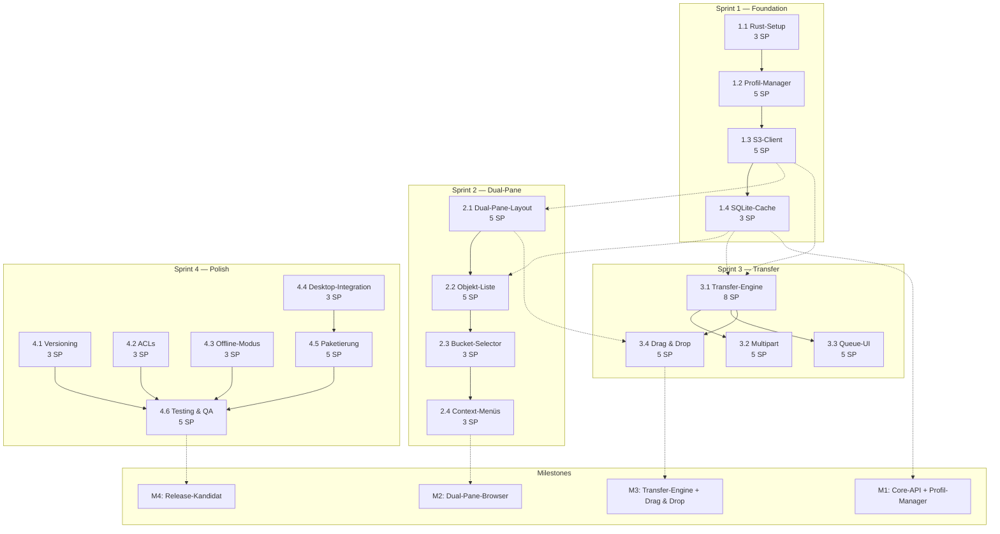
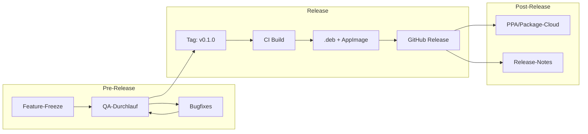

# Stream Orchestration — r2

> **Projekt:** r2 — Nativer S3-kompatibler Object-Storage-Browser für Ubuntu Linux
> **Version:** 1.0
> **Basiert auf:** SRD.md, TECH_STACK.md, ADR-001–005, SPRINT_BACKLOG.md

---

## 1. Stream Map

| Stream | Besitzt | Hängt ab von | Liefert an |
|--------|---------|-------------|------------|
| **Core** | S3-Client, Transfer-Engine, Cache, Credentials | — | UI, DevOps |
| **UI** | GTK4-Widgets, Panes, Dialogs, Drag & Drop, Transfer-Queue-UI | Core (API-Contracts) | DevOps, QA |
| **DevOps** | Build, .deb, AppImage, CI/CD, Desktop-Integration | Core + UI (fertige Binary) | QA, Release |
| **QA** | Tests, Coverage, MinIO-Integration, Code-Review | Core + UI | Release |

### 1.1 Stream-Verantwortlichkeiten im Detail

#### Core-Stream

| Komponente | Verantwortlichkeiten | Dateipfad (geplant) |
|-----------|---------------------|-------------------|
| `S3Client` | Bucket-Listing, Objekt-Listing, CRUD-Operationen, Multipart, Versioning, ACLs | `r2-core/src/s3/client.rs` |
| `TransferEngine` | Async-Task-Management, PriorityQueue, Progress-Stream, State-Machine, Retry-Logik | `r2-core/src/transfer/engine.rs` |
| `CacheManager` | SQLite-DB, Bucket-Cache, Object-Cache, Transfer-Cache, TTL-Invalidierung | `r2-core/src/cache/database.rs` |
| `CredentialManager` | libsecret-Backend, EncryptedFile-Fallback, Zeroize, Log-Filter | `r2-core/src/credentials/libsecret.rs` |
| `Config` | TOML-Parsing, Profil-Konfiguration, Cache-Pfad | `r2-core/src/config.rs` |
| `Error` | Einheitliches Error-Handling, User-facing Messages | `r2-core/src/error.rs` |

#### UI-Stream

| Komponente | Verantwortlichkeiten | Dateipfad (geplant) |
|-----------|---------------------|-------------------|
| `MainWindow` | GtkApplication, Menüleiste, Toolbar, Statusleiste | `r2-ui/src/main_window.rs` |
| `S3Pane` | Dual-Pane-Widget, Pane-Header, Split-View, Pane-Footer | `r2-ui/src/pane.rs` |
| `ObjectList` | GtkColumnView, Lazy Loading, Sortierung, Mehrfachauswahl | `r2-ui/src/object_list.rs` |
| `BucketSelector` | GtkDropDown, Bucket-Tree, Context-Menüs | `r2-ui/src/bucket_selector.rs` |
| `Breadcrumb` | Pfad-Navigation, klickbare Ebenen, Pfad-Eingabe | `r2-ui/src/breadcrumb.rs` |
| `TransferQueueUI` | Queue-Panel, Tabs, Fortschrittsbalken, Pause/Resume/Cancel | `r2-ui/src/transfer_queue.rs` |
| `ProfileManager` | Profil-Dialog, Formular, Test Connection | `r2-ui/src/profile_manager.rs` |
| `DragDrop` | GdkDrag/GdkDrop, MIME-Type-Handling, Drop-Target-Validierung | `r2-ui/src/drag_drop.rs` |
| `Dialogs` | Bucket-Properties, ACL-Editor, Objekt-Info, Bestätigungsdialoge | `r2-ui/src/dialogs/` |

#### DevOps-Stream

| Komponente | Verantwortlichkeiten | Dateipfad (geplant) |
|-----------|---------------------|-------------------|
| `cargo-deb` | .deb-Paket mit Varianten für Ubuntu 22.04/24.04 | `Cargo.toml` + `scripts/` |
| `appimage` | AppImage-Build mit gebündelten Dependencies | `appimage.yml` |
| `CI/CD` | GitHub Actions: Build, Test, Lint, Package, Release | `.github/workflows/ci.yml` |
| `Desktop` | .desktop-Datei, AppStream-Metadaten, Icons | `assets/` |

#### QA-Stream

| Komponente | Verantwortlichkeiten | Dateipfad (geplant) |
|-----------|---------------------|-------------------|
| `Unit-Tests` | Core-Logik: Transfer-Engine, Cache, Credentials | `r2-core/src/**/*.rs` (inline) |
| `Integration-Tests` | MinIO-Docker, S3-Operationen, Transfer-Szenarien | `tests/integration/` |
| `UI-Tests` | gtk4-rs Test-Framework, Pane-Interaktionen | `tests/ui/` |
| `Coverage` | > 80% Code-Coverage via `cargo-llvm-cov` | CI-Report |

---

## 2. Interface Contracts

### 2.1 Core → UI: S3Client-Trait

Definiert in [`r2-core/src/traits.rs`](r2-core/src/traits.rs) (zu erzeugen).

```rust
/// S3-Client-Trait — alle S3-Operationen sind async
#[async_trait]
pub trait S3Client: Send + Sync {
    /// Buckets des verbundenen Profils listen
    async fn list_buckets(&self) -> Result<Vec<BucketInfo>, S3Error>;

    /// Objekte in einem Bucket/Prefix listen (paginiert)
    async fn list_objects(
        &self,
        bucket: &str,
        prefix: &str,
        delimiter: &str,
        max_keys: i32,
        continuation_token: Option<String>,
    ) -> Result<ObjectListResponse, S3Error>;

    /// Objekt-Metadaten abrufen (HeadObject)
    async fn head_object(&self, bucket: &str, key: &str) -> Result<ObjectInfo, S3Error>;

    /// Objekt hochladen (PUT)
    async fn put_object(&self, bucket: &str, key: &str, data: Vec<u8>) -> Result<(), S3Error>;

    /// Objekt herunterladen (GET)
    async fn get_object(&self, bucket: &str, key: &str) -> Result<Vec<u8>, S3Error>;

    /// Objekt löschen (DELETE)
    async fn delete_object(&self, bucket: &str, key: &str) -> Result<(), S3Error>;

    /// Objekt kopieren (COPY) — innerhalb eines Endpunkts
    async fn copy_object(
        &self,
        source_bucket: &str,
        source_key: &str,
        dest_bucket: &str,
        dest_key: &str,
    ) -> Result<(), S3Error>;

    /// Multipart-Upload initialisieren
    async fn create_multipart_upload(
        &self, bucket: &str, key: &str,
    ) -> Result<String, S3Error>; // returns upload_id

    /// Multipart-Part hochladen
    async fn upload_part(
        &self, bucket: &str, key: &str, upload_id: &str,
        part_number: i32, data: Vec<u8>,
    ) -> Result<String, S3Error>; // returns ETag

    /// Multipart-Upload abschließen
    async fn complete_multipart_upload(
        &self, bucket: &str, key: &str, upload_id: &str, parts: Vec<Part>,
    ) -> Result<(), S3Error>;

    /// Multipart-Upload abbrechen
    async fn abort_multipart_upload(
        &self, bucket: &str, key: &str, upload_id: &str,
    ) -> Result<(), S3Error>;

    // --- Should-Have (S-01, S-02) ---

    /// Versionen eines Objekts listen
    async fn list_object_versions(
        &self, bucket: &str, prefix: &str,
    ) -> Result<Vec<ObjectVersion>, S3Error>;

    /// Bucket-ACL abrufen
    async fn get_bucket_acl(&self, bucket: &str) -> Result<Acl, S3Error>;

    /// Bucket-ACL setzen
    async fn put_bucket_acl(&self, bucket: &str, acl: &Acl) -> Result<(), S3Error>;
}
```

### 2.2 Core → UI: TransferEngine-Trait

Definiert in [`r2-core/src/traits.rs`](r2-core/src/traits.rs).

```rust
/// Transfer-Engine-Trait
#[async_trait]
pub trait TransferEngine: Send + Sync {
    /// Neuen Transfer-Job erstellen und zur Queue hinzufügen
    async fn enqueue(&self, job: TransferJob) -> Result<(), TransferError>;

    /// Transfer pausieren
    async fn pause(&self, job_id: Uuid) -> Result<(), TransferError>;

    /// Transfer fortsetzen
    async fn resume(&self, job_id: Uuid) -> Result<(), TransferError>;

    /// Transfer abbrechen
    async fn cancel(&self, job_id: Uuid) -> Result<(), TransferError>;

    /// Alle pausierten Transfers fortsetzen
    async fn resume_all_paused(&self) -> Result<(), TransferError>;

    /// Alle fehlgeschlagenen Transfers wiederholen
    async fn retry_all_failed(&self) -> Result<(), TransferError>;

    /// Aktuelle Queue abrufen (für UI-Initialisierung)
    async fn get_queue(&self) -> Result<Vec<TransferJob>, TransferError>;

    /// Progress-Stream abonnieren
    fn subscribe(&self) -> broadcast::Receiver<ProgressEvent>;

    /// Maximale parallele Transfers setzen
    fn set_max_concurrent(&self, max: usize);

    /// Graceful Shutdown einleiten
    async fn shutdown(&self);
}
```

### 2.3 Core → UI: CacheManager-Trait

Definiert in [`r2-core/src/traits.rs`](r2-core/src/traits.rs).

```rust
/// Cache-Manager-Trait
pub trait CacheManager: Send + Sync {
    /// Gecachte Buckets für ein Profil abrufen
    fn get_cached_buckets(&self, profile_id: &str) -> Result<Vec<BucketInfo>, CacheError>;

    /// Gecachte Objekte für einen Prefix abrufen
    fn get_cached_objects(
        &self, profile_id: &str, bucket: &str, prefix: &str,
    ) -> Result<Vec<ObjectInfo>, CacheError>;

    /// Cache für Buckets aktualisieren
    fn update_buckets(&self, profile_id: &str, buckets: &[BucketInfo]) -> Result<(), CacheError>;

    /// Cache für Objekte aktualisieren (Batch-Upsert)
    fn update_objects(
        &self, profile_id: &str, bucket: &str, objects: &[ObjectInfo],
    ) -> Result<(), CacheError>;

    /// Prüfen, ob Cache für einen Prefix aktuell ist
    fn is_cache_fresh(&self, profile_id: &str, bucket: &str, prefix: &str) -> bool;

    /// Cache für ein Profil komplett leeren
    fn invalidate_profile(&self, profile_id: &str) -> Result<(), CacheError>;

    /// Transfer-Queue aus Cache laden (für Resume nach Neustart)
    fn load_transfer_queue(&self) -> Result<Vec<TransferJob>, CacheError>;

    /// Transfer-Job-Status im Cache persistieren
    fn persist_transfer_job(&self, job: &TransferJob) -> Result<(), CacheError>;
}
```

### 2.4 UI → Core: Signal-basierte Events

Definiert in [`r2-core/src/events.rs`](r2-core/src/events.rs) (zu erzeugen).

```rust
/// Pane-Events — kommuniziert zwischen UI-Panes und Core
#[derive(Debug, Clone)]
pub enum PaneEvent {
    /// Profil wurde in einem Pane gewechselt
    ProfileChanged {
        pane_id: PaneId,
        profile_id: String,
    },
    /// Bucket wurde in einem Pane gewechselt
    BucketChanged {
        pane_id: PaneId,
        bucket_name: String,
    },
    /// Navigation zu einem anderen Prefix
    PrefixChanged {
        pane_id: PaneId,
        prefix: String,
    },
    /// Objekt(e) wurden selektiert
    ObjectsSelected {
        pane_id: PaneId,
        objects: Vec<ObjectInfo>,
    },
    /// Dateien wurden per Drag & Drop in ein Pane gezogen
    DropFiles {
        target_pane: PaneId,
        file_paths: Vec<String>,
        target_prefix: String,
    },
    /// S3-Objekte wurden per Drag & Drop auf ein anderes Pane gezogen
    DropObjects {
        source_pane: PaneId,
        target_pane: PaneId,
        objects: Vec<ObjectInfo>,
    },
    /// Transfer wurde angefordert (z.B. aus Context-Menü)
    TransferRequested {
        job: TransferJob,
    },
}

/// Pane-Identität
#[derive(Debug, Clone, Copy, PartialEq, Eq)]
pub enum PaneId {
    A,
    B,
}
```

### 2.5 DevOps → All: Build-Interface

```toml
# Cargo.toml — zentrale Dependencies für alle Crates
[workspace]
members = ["r2-core", "r2-ui", "r2-cli"]

[workspace.dependencies]
gtk4 = { version = "0.9", features = ["v4_14"] }
tokio = { version = "1", features = ["full"] }
aws-sdk-s3 = "1"
rusqlite = { version = "0.32", features = ["bundled"] }
secret-service = "4"
tracing = "0.1"
serde = { version = "1", features = ["derive"] }
# ... weitere Dependencies gemäß TECH_STACK.md
```

---

## 3. Integration Milestones

```mermaid
gantt
    title r2 — Integration Milestones
    dateFormat  YYYY-MM-DD
    axisFormat  %b Woche %V

    section Sprint 1 — Foundation
    M1: Core-API stabil, UI zeigt Hauptfenster mit Profil-Manager :milestone, 2026-05-24, 0d

    section Sprint 2 — Dual-Pane
    M2: Dual-Pane-Browser funktionsfähig, alle Navigation-Features :milestone, 2026-06-07, 0d

    section Sprint 3 — Transfer
    M3: Transfer-Engine integriert, Drag & Drop funktioniert :milestone, 2026-06-21, 0d

    section Sprint 4 — Polish
    M4: Release-Kandidat, .deb/AppImage, alle Tests grün :milestone, 2026-07-05, 0d
```

### M1 — Ende Sprint 1 (Woche 2)

**Datum:** 2026-05-24

**Kriterien:**
- [ ] Core-API (S3Client, TransferEngine, CacheManager, CredentialManager-Traits) ist stabil und dokumentiert
- [ ] UI zeigt GTK4-Hauptfenster mit Menüleiste, Toolbar, Statusleiste
- [ ] Profil-Manager-Dialog: Erstellen, Bearbeiten, Löschen, Test Connection
- [ ] S3-Client listet Buckets und Objekte von mindestens MinIO
- [ ] SQLite-Cache wird befüllt und kann gelesen werden
- [ ] `cargo build` läuft, `cargo deb` produziert .deb
- [ ] Integration-Test: Profil anlegen → MinIO verbinden → Buckets listen

**Integration-Test-Szenario M1:**
```
1. MinIO per Docker starten (docker run -p 9000:9000 minio/minio server /data)
2. r2 starten
3. Profil "minio-local" anlegen (http://localhost:9000, access_key=minioadmin, secret_key=minioadmin)
4. Test Connection → grün
5. Bucket-Liste zeigt "test-bucket" (vorher via mc oder aws-cli angelegt)
6. Objekt-Liste zeigt Inhalt von test-bucket
7. App schließen → Cache persistiert
8. App neu starten → Cache zeigt gecachte Buckets
```

### M2 — Ende Sprint 2 (Woche 4)

**Datum:** 2026-06-07

**Kriterien:**
- [ ] Zwei unabhängige Panes nebeneinander mit GtkPaned
- [ ] Jedes Pane hat eigenen Profil-Dropdown, Bucket-Selector, Breadcrumb
- [ ] Objekt-Liste mit Lazy Loading (100 Objekte/Page), Sortierung, Mehrfachauswahl
- [ ] Bucket-Selector mit allen States (Loading, Empty, Error)
- [ ] Breadcrumb-Navigation: Bucket > Prefix1 > Prefix2 (klickbar)
- [ ] Context-Menüs für Objekte und Buckets mit allen Aktionen
- [ ] Resize-Griff funktioniert, Position wird gespeichert
- [ ] Integration-Test: Pane A = MinIO, Pane B = Wasabi → paralleles Browsing

**Integration-Test-Szenario M2:**
```
1. Zwei MinIO-Instanzen starten (Port 9000 und 9001)
2. r2 starten, zwei Profile anlegen
3. Pane A mit Profil 1 verbinden → Bucket "source" öffnen
4. Pane B mit Profil 2 verbinden → Bucket "dest" öffnen
5. In Pane A: Navigation images/2024/ → Breadcrumb zeigt "Bucket > images > 2024"
6. Sortierung nach Größe → funktioniert
7. Rechtsklick auf Objekt → Download-Dialog öffnet sich
8. Rechtsklick auf Bucket → Properties-Dialog öffnet sich
9. Pane-Resize → Position wird gespeichert
```

### M3 — Ende Sprint 3 (Woche 6)

**Datum:** 2026-06-21

**Kriterien:**
- [ ] Transfer-Engine: Parallele Transfers, Pause/Resume, Retry, Graceful Shutdown
- [ ] Multipart-Upload/Download für Dateien > 100 MB
- [ ] Transfer-Queue-UI: Tabs (Active/Completed/Failed), Fortschritt, Speed, ETA
- [ ] Drag & Drop: Pane→Pane, Dateimanager→Pane, Pane→Dateimanager
- [ ] Ordner rekursiv per Drag & Drop
- [ ] Persistente Queue: Transfers überleben App-Neustart
- [ ] Integration-Test: 1GB-Datei via Multipart hochladen, Pause/Resume, Abbruch

**Integration-Test-Szenario M3:**
```
1. Zwei MinIO-Instanzen (9000 und 9001)
2. Pane A = MinIO-1, Pane B = MinIO-2
3. 1GB-Testdatei via Multipart von lokal → MinIO-1 hochladen
4. Drag & Drop von Pane A → Pane B: S3→S3-Transfer startet
5. Transfer pausieren → Status "Paused" (gelb)
6. Transfer fortsetzen → Status "Active" (blau)
7. Während des Transfers: App schließen → Neustart → Transfer wird fortgesetzt
8. Drag & Drop aus Nautilus in Pane A → Upload startet
9. Ordner mit 50 Dateien per Drag & Drop → rekursiver Upload
```

### M4 — Ende Sprint 4 (Woche 8)

**Datum:** 2026-07-05

**Kriterien:**
- [ ] Versioning: History anzeigen, Restore, Delete
- [ ] ACL-Management: Lesen, Setzen, Grantee-Verwaltung
- [ ] Offline-Modus: Cache-basiertes Browsing ohne Netzwerk
- [ ] Desktop-Integration: .desktop, AppStream, Notifications
- [ ] .deb-Paket für Ubuntu 22.04 + 24.04
- [ ] AppImage-Build
- [ ] GitHub Actions CI/CD: Build + Test + Lint + Package + Release
- [ ] > 80% Code-Coverage
- [ ] Alle Tests grün

**Integration-Test-Szenario M4:**
```
1. Versioning: Bucket mit Versioning → Objekt versionieren → History anzeigen → Restore
2. ACLs: Bucket-ACL lesen → Canned ACL setzen → Grantee hinzufügen
3. Offline: Netzwerk trennen → Cache zeigt gecachte Daten → Sync-Status "Offline"
4. .deb installieren: sudo apt install ./r2_0.1.0_amd64.deb → App erscheint im GNOME-Menü
5. AppImage: ./r2-0.1.0-x86_64.AppImage → App startet ohne Installation
6. CI: GitHub Actions läuft durch → .deb + AppImage als Release-Assets
7. Coverage: cargo-llvm-cov zeigt > 80%
```

---

## 4. Abhängigkeitsgraph (Vollständig)



---

## 5. Stream-Kommunikationsmatrix

| Von \ An | Core | UI | DevOps | QA |
|----------|------|----|--------|----|
| **Core** | — | Traits: S3Client, TransferEngine, CacheManager, CredentialManager | Cargo.toml Dependencies | Test-Helper, Mocks |
| **UI** | PaneEvent-Signals | — | Fertige Binary | Test-Szenarien, Bug-Reports |
| **DevOps** | Build-Script, CI-Config | CI-Config, Release-Script | — | CI-Infrastruktur, Coverage-Tools |
| **QA** | Test-Ergebnisse, Coverage | Test-Ergebnisse, UI-Test-Scripts | CI-Pipeline-Status | — |

### 5.1 Kommunikationskanäle

| Kanal | Zweck | Frequenz | Verantwortlich |
|-------|-------|----------|----------------|
| **Tägliches Standup** | Blockaden, Fortschritt, Abhängigkeiten | Täglich, 15min | Alle Streams |
| **Sprint-Review** | Demo der fertigen Stories, Feedback | Alle 2 Wochen | Alle Streams |
| **API-Review** | Interface-Contracts abstimmen (Core ↔ UI) | Vor Sprint 2 + Sprint 3 | Core + UI Lead |
| **Integration-Test-Review** | Gemeinsame Test-Szenarien validieren | Vor M1, M2, M3, M4 | QA + Core + UI |
| **Code-Review** | Qualitätssicherung, Wissensaustausch | Pro Story | Alle Entwickler:innen |

---

## 6. Risikomanagement pro Stream

| Stream | Risiko | Eintrittswahrscheinlichkeit | Auswirkung | Maßnahme |
|--------|--------|---------------------------|------------|----------|
| **Core** | aws-sdk-s3 Build-Zeit > 10min | Hoch | Mittel | CI-Caching, `sccache`, parallele Compilation |
| **Core** | libsecret in CI nicht verfügbar | Mittel | Mittel | Fallback-Backend + CI-spezifische Konfiguration |
| **UI** | gtk4-rs API unvollständig für Custom Widgets | Mittel | Hoch | Frühzeitiges Prototyping, ggf. Workaround mit Standard-Widgets |
| **UI** | GTK4 Drag & Drop unter Wayland inkonsistent | Niedrig | Hoch | Test auf Wayland ab Sprint 1, X11-Fallback |
| **UI** | GtkColumnView Performance bei 10.000+ Zeilen | Mittel | Mittel | Virtualisierung, Lazy Loading, Pagination |
| **DevOps** | AppImage > 100 MB durch gebündelte GTK4-Libs | Mittel | Niedrig | UPX-Kompression, Strip, Library-Optimierung |
| **DevOps** | Unterschiedliche GTK4-Versionen (22.04 vs 24.04) | Hoch | Mittel | cargo-deb Varianten, CI-Matrix-Build |
| **QA** | MinIO in CI nicht stabil (Docker-Overhead) | Niedrig | Mittel | Retry-Logik, Health-Check vor Tests |
| **QA** | UI-Tests mit gtk4-rs Headless schwierig | Mittel | Hoch | Xvfb in CI, Fokus auf Core-Integration-Tests |

---

## 7. Release-Kriterien

### 7.1 Qualitäts-Gates

| Gate | Kriterium | Prüfung |
|------|-----------|---------|
| **G1: Code-Qualität** | Keine Compiler-Warnings, `cargo clippy` ohne Warnungen, `cargo fmt` eingehalten | CI-Pipeline |
| **G2: Tests** | Alle Unit-Tests + Integration-Tests grün, > 80% Coverage | CI-Pipeline |
| **G3: Integration** | M1–M4 Integration-Test-Szenarien bestanden | Manuelle QA |
| **G4: Paketierung** | .deb installierbar, AppImage startbar | Manuelle Prüfung |
| **G5: UX** | Alle User Flows aus UX_CONCEPTION Abschnitt 1 durchspielbar | Manuelle QA |
| **G6: Sicherheit** | Keine Credentials in Logs, libsecret funktioniert | Code-Review + Test |

### 7.2 Release-Prozess



---

> **Dokumentversion:** 1.0
> **Erstellt:** 11. Mai 2026
> **Basiert auf:** SRD.md v1.0, TECH_STACK.md v1.0, ADR-001–005, SPRINT_BACKLOG.md v1.0
