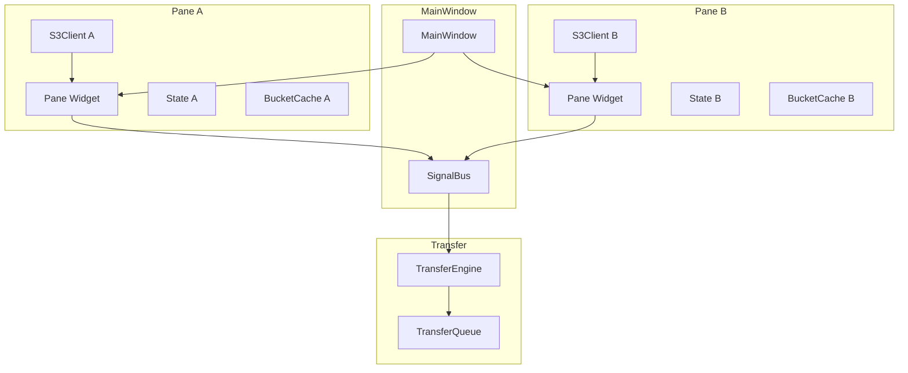
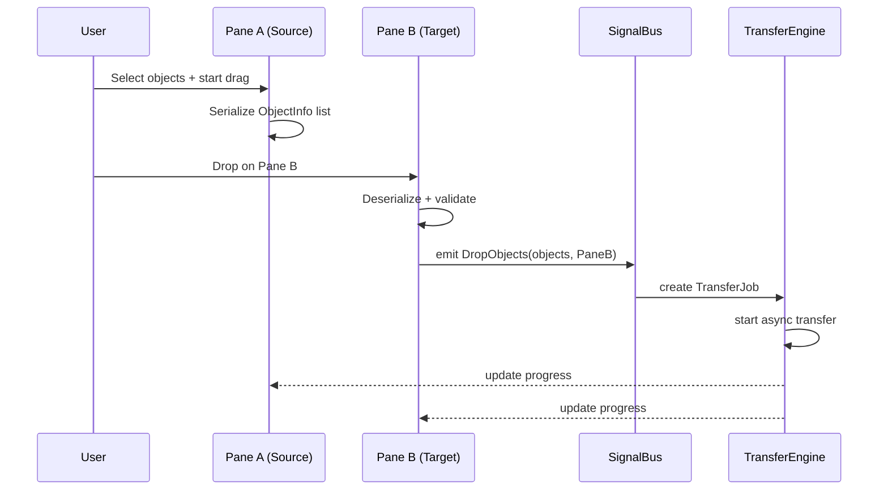

# ADR-001: Dual-Pane-Architektur

> **Status:** Accepted
> **Datum:** 2026-05-11
> **Kontext:** SRD M-02, UX_CONCEPTION Abschnitt 2.1, 3.1

---

## Kontext

Die Applikation r2 benötigt zwei unabhängige S3-Browser-Panes nebeneinander, um parallele S3-Endpunkt-Verwaltung und effiziente S3→S3-Transfers per Drag & Drop zu ermöglichen (UC-02, UC-03). Jedes Pane muss:

- einen eigenen S3-Endpunkt (oder lokalen Ordner) laden können
- unabhängig navigierbar sein (Bucket-Auswahl, Prefix-Navigation)
- eigene Verbindungsstatus- und Cache-Zustände verwalten
- Drag & Drop zwischen den Panes unterstützen (S3→S3-Transfer)
- Drag & Drop aus dem Dateimanander in ein Pane unterstützen (Upload)

---

## Entscheidung

Jedes Pane wird als eigenständiger `S3Pane`-Widget implementiert, der eine eigene `S3Client`-Instanz und einen eigenen State-Manager besitzt. Die Panes kommunizieren über ein Signal-Bus-System für Drag & Drop und profilübergreifende Aktionen.

### Architektur



### Pane-State-Modell

```rust
struct PaneState {
    profile_id: Option<String>,
    profile_name: Option<String>,
    bucket_name: Option<String>,
    current_prefix: String,
    is_connected: bool,
    is_local: bool,
    local_path: Option<PathBuf>,
    objects: Vec<ObjectInfo>,
    buckets: Vec<BucketInfo>,
    loading_state: LoadingState,
    sort_column: SortColumn,
    sort_direction: SortDirection,
}
```

### Signal-Bus-Events

```rust
enum PaneEvent {
    ProfileChanged(String),
    BucketChanged(String),
    PrefixChanged(String),
    ObjectsSelected(Vec<ObjectInfo>),
    DropFiles(Vec<String>, String),       // (paths, target_prefix)
    DropObjects(Vec<ObjectInfo>, PaneId), // (objects, target_pane)
    TransferRequested(TransferJob),
}
```

### Drag & Drop-Datenfluss



---

## Konsequenzen

### Positiv

- **Klare Trennung der Verantwortlichkeiten:** Jedes Pane ist ein unabhängiger Widget mit eigenem Lebenszyklus
- **Parallele Verbindungen möglich:** Zwei verschiedene S3-Endpunkte gleichzeitig, mit jeweils eigener `S3Client`-Instanz
- **Unabhängige Navigation:** Bucket-Wechsel in Pane A beeinflusst Pane B nicht
- **Wiederverwendbarkeit:** `S3Pane` kann auch für lokale Ordner verwendet werden (is_local = true)
- **Testbarkeit:** Panes können isoliert getestet werden (Unit-Tests mit Mock-S3-Client)

### Negativ

- **Doppelter Ressourcenverbrauch:** Zwei `S3Client`-Instanzen bedeuten doppelte TCP-Verbindungen, doppelten Speicher für Credentials im RAM
- **Komplexität der Synchronisation:** Bei Aktionen wie "In anderem Pane öffnen" muss der SignalBus koordinieren
- **State-Konsistenz:** Beide Panes müssen bei Profil-Änderungen (z.B. Löschen eines Profils) benachrichtigt werden

---

## Alternativen

### Single-Pane mit Tab-Wechsel

**Beschreibung:** Ein einzelnes Pane, das zwischen verschiedenen Profilen/Buckets per Tab umgeschaltet wird.

**Verworfen, weil:**
- S3→S3-Drag & Drop ist nicht möglich (kein zweites Pane sichtbar)
- Kein paralleles Browsing — Benutzer muss ständig zwischen Tabs wechseln
- UX-Komplexität: Tab-Management + Drag & Drop zwischen Tabs ist unintuitiv

### Single-Pane mit Split-View (ein S3Client)

**Beschreibung:** Zwei Panes, die sich einen einzigen `S3Client` teilen.

**Verworfen, weil:**
- Keine parallelen Verbindungen zu verschiedenen Endpunkten möglich
- State-Konflikte: Ein Client kann nicht gleichzeitig zwei verschiedene Buckets von zwei verschiedenen Endpunkten listen
- Credential-Wechsel würde beide Panes beeinflussen

---

## Implementierungshinweise

1. **Pane-Erzeugung:** `MainWindow` erzeugt zwei `S3Pane`-Instanzen und fügt sie in ein `GtkPaned` ein
2. **Pane-Resize:** `GtkPaned` mit Position-Speicherung in Config (siehe UX_CONCEPTION 4.5)
3. **SignalBus:** Als `glib::Object` mit benutzerdefinierten Signals implementiert
4. **Drag & Drop:** GTK4 `GdkDrag` + `GdkDrop` API mit MIME-Type `application/x-r2-object`
5. **Pane-Identität:** Jedes Pane hat eine eindeutige `PaneId` (Enum: `PaneA`, `PaneB`)
6. **Lokale Ordner:** Bei `is_local = true` wird statt `S3Client` ein `std::fs`-basiertes Listing verwendet

---

> **Referenzen:** SRD M-02, M-04.06, M-04.07; UX_CONCEPTION 2.1, 3.1, 4.1
