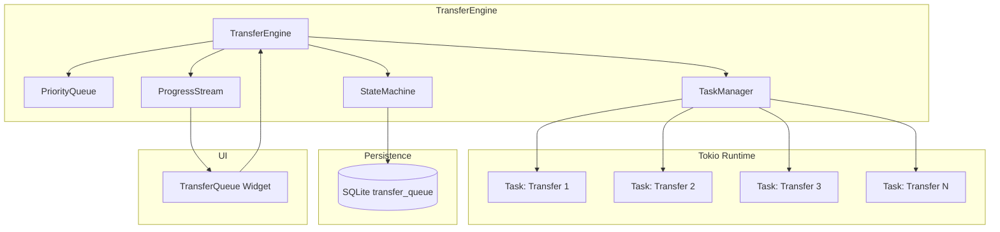
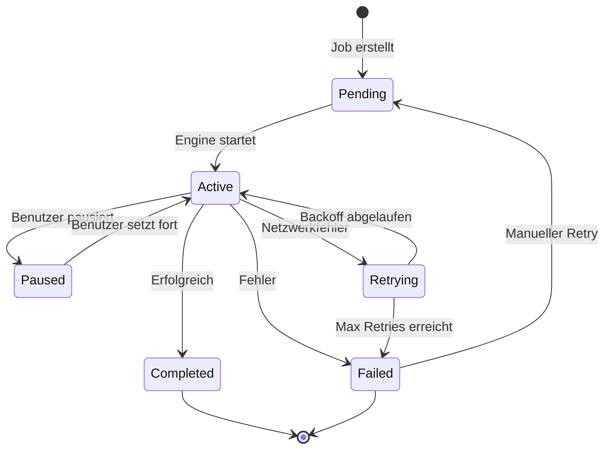

# ADR-002: Async-Transfer-Engine

> **Status:** Accepted
> **Datum:** 2026-05-11
> **Kontext:** SRD M-04, S-03, S-05; UX_CONCEPTION Abschnitt 1.3, 1.7, 3.5

---

## Kontext

r2 muss Dateien zwischen S3-Endpunkten (S3→S3), zwischen lokalem Dateisystem und S3 (Upload/Download) sowie innerhalb eines S3-Endpunkts (Copy/Move) transferieren können. Die Anforderungen umfassen:

- Parallele Transfers (Default: 4 gleichzeitig, konfigurierbar 1–16)
- Pause/Resume-Funktionalität
- Resume nach App-Neustart (persistente Queue)
- Automatischer Retry bei Netzwerkfehlern (exponentieller Backoff)
- Fortschrittsanzeige pro Transfer (%, Geschwindigkeit, ETA)
- Priorisierung (Hoch, Normal, Niedrig)
- Multipart-Upload/Download für große Dateien

---

## Entscheidung

Eine zentrale `TransferEngine`-Komponente auf Basis von Tokio-Tasks. Jeder Transfer ist ein eigener asynchroner Task mit eigenem Progress-Stream. Die Engine managed eine PriorityQueue und persistiert den Zustand in SQLite für Resume-Fähigkeit.

### Architektur



### Transfer-Job-Definition

```rust
struct TransferJob {
    id: Uuid,
    source: TransferSource,
    destination: TransferDestination,
    direction: TransferDirection,
    total_bytes: u64,
    transferred_bytes: Arc<AtomicU64>,
    status: TransferStatus,
    priority: Priority,
    error_message: Option<String>,
    created_at: DateTime<Utc>,
    updated_at: DateTime<Utc>,
    retry_count: u8,
    max_retries: u8,
    parts: Vec<PartInfo>,  // für Multipart
}

enum TransferDirection {
    S3ToS3,
    LocalToS3,
    S3ToLocal,
}

enum TransferStatus {
    Pending,
    Active,
    Paused,
    Completed,
    Failed,
}
```

### Transfer-State-Machine



### Progress-Stream

```rust
enum ProgressEvent {
    Started {
        job_id: Uuid,
        total_bytes: u64,
    },
    Progress {
        job_id: Uuid,
        transferred_bytes: u64,
        speed_bytes_per_sec: f64,
    },
    PartCompleted {
        job_id: Uuid,
        part_number: u32,
        bytes: u64,
    },
    Paused {
        job_id: Uuid,
    },
    Resumed {
        job_id: Uuid,
    },
    Completed {
        job_id: Uuid,
        duration: Duration,
        avg_speed: f64,
    },
    Failed {
        job_id: Uuid,
        error: String,
        retryable: bool,
    },
}
```

### Parallelitätssteuerung

```rust
struct TransferEngine {
    max_concurrent: Arc<AtomicUsize>,  // Default: 4
    active_tasks: Arc<DashMap<Uuid, JoinHandle<()>>>,
    queue: Arc<Mutex<PriorityQueue<TransferJob>>>,
    progress_tx: broadcast::Sender<ProgressEvent>,
    shutdown: Arc<AtomicBool>,
}
```

---

## Konsequenzen

### Positiv

- **Echte Parallelität:** Tokio Work-Stealing Scheduler nutzt alle CPU-Kerne für parallele Transfers
- **Async-Cancellation:** Tokio-Tasks können sauber abgebrochen werden (via `CancellationToken`)
- **Resume nach Crash:** Persistente Queue in SQLite ermöglicht Wiederaufnahme nach App-Neustart
- **Progress-Stream:** `broadcast::Sender` erlaubt mehrere Empfänger (UI, Logging, Desktop-Notifications)
- **Priorisierung:** `PriorityQueue` stellt sicher, dass wichtige Transfers zuerst bearbeitet werden

### Negativ

- **Komplexität der State-Machine:** Die Zustandsübergänge (Pause, Resume, Retry, Cancel) müssen sauber implementiert sein
- **Ressourcen-Management:** Bei vielen parallelen Transfers muss der Speicherverbrauch überwacht werden (insbesondere bei Multipart)
- **Graceful Shutdown:** Laufende Transfers müssen bei App-Beendigung korrekt pausiert werden (SIGTERM/SIGINT-Handler)
- **Race Conditions:** Gleichzeitiger Zugriff auf die Queue von UI-Thread und Tokio-Tasks erfordert sorgfältige Synchronisation

---

## Alternativen

### Thread-Pool (std::thread)

**Beschreibung:** Klassischer Thread-Pool statt Tokio-Tasks. Jeder Transfer läuft in einem eigenen OS-Thread.

**Verworfen, weil:**
- Keine Async-Cancellation — Threads können nicht sauber abgebrochen werden (nur via `pthread_cancel`, was unsicher ist)
- Höherer Overhead pro Thread (Stack-Speicher, Context-Switching)
- Keine native Integration mit `aws-sdk-s3` (das Tokio-basiert ist)
- Komplexeres Pause/Resume — Threads müssen auf Condition Variables warten

### Single-Threaded Event-Loop

**Beschreibung:** Ein einziger Event-Loop, der alle Transfers nacheinander bearbeitet.

**Verworfen, weil:**
- Keine Parallelität — Transfers blockieren sich gegenseitig
- NFR-PERF-05 (parallele Transfers) nicht erfüllbar
- UI würde bei großen Dateien blockieren

---

## Implementierungshinweise

1. **Tokio-Runtime:** Eine einzige Multi-Threaded-Runtime für alle Transfers, gestartet in `main.rs`
2. **UI-Kommunikation:** Progress-Events via `glib::spawn_closure()` in den GTK4-Hauptthread senden
3. **Pause/Resume:** `tokio::sync::Notify` für effizientes Warten ohne Busy-Waiting
4. **Multipart:** `aws-sdk-s3` Multipart-API direkt nutzen; Part-Status in SQLite persistieren
5. **Retry-Logik:** Exponentieller Backoff: 1s → 2s → 4s → 8s → max 30s, max 3 Versuche
6. **Graceful Shutdown:** `tokio::signal::ctrl_c()` + `CancellationToken` für alle aktiven Tasks
7. **Bandbreiten-Limit (Could-Have C-03.01):** Token-Bucket-Algorithmus pro Transfer-Job

---

> **Referenzen:** SRD M-04, S-03, S-05, NFR-REL-01–04; UX_CONCEPTION 1.3, 1.7, 3.5
