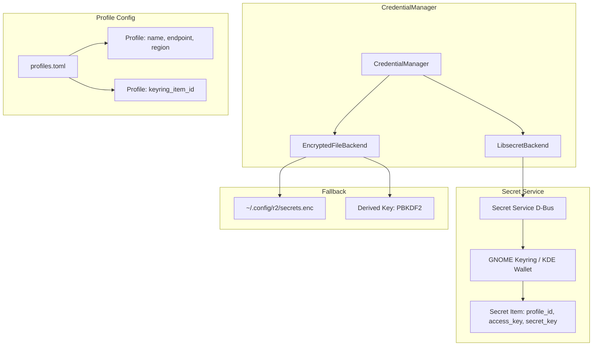
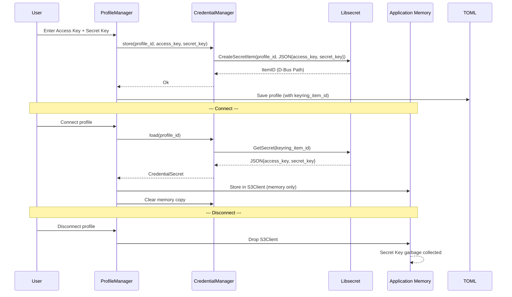

# ADR-003: Credential-Storage via libsecret

> **Status:** Accepted
> **Datum:** 2026-05-11
> **Kontext:** SRD M-01.04, NFR-SEC-01–06; UX_CONCEPTION Abschnitt 5.1

---

## Kontext

S3-Credentials (Access Key, Secret Key) müssen sicher gespeichert werden. Sie dürfen niemals im Klartext auf der Festplatte liegen. Die Anforderungen umfassen:

- Secret Keys werden ausschließlich über libsecret (Linux Secret Service) gespeichert (M-01.04)
- Credentials niemals im Klartext auf der Festplatte (NFR-SEC-01)
- Secret Key nur im Arbeitsspeicher entschlüsselt (NFR-SEC-02)
- Keine Credentials in Logs, Core-Dumps oder Crash-Reports (NFR-SEC-03)
- Sicheres Löschen von Credentials beim Profil-Löschen (NFR-SEC-05)
- Keine Hardcoded Credentials im Binary (NFR-SEC-06)
- Fallback-Mechanismus, wenn kein Secret Service verfügbar ist

---

## Entscheidung

Nutzung der Linux Secret Service API via `secret-service-rs` (Rust-Crate). Profile speichern nur eine D-Bus-Path-Referenz (die Item-ID im Keyring), die tatsächlichen Secrets liegen im System Keyring (GNOME Keyring / KDE Wallet). Als Fallback wird eine AES-256-GCM-verschlüsselte Datei verwendet, wenn kein Secret Service verfügbar ist.

### Architektur



### Credential-Schema (libsecret)

```rust
// Secret Service Schema
const R2_SCHEMA: &str = "com.r2.s3-credentials";

struct SecretSchema {
    profile_id: String,    // UUID
    profile_name: String,  // Für Anzeige im Keyring-Manager
}

// Secret Payload (JSON)
struct CredentialSecret {
    access_key: String,
    secret_key: String,
}
```

### CredentialManager-API

```rust
struct CredentialManager {
    backend: Box<dyn CredentialBackend>,
}

#[async_trait]
trait CredentialBackend {
    /// Credentials für ein Profil speichern
    async fn store(&self, profile_id: &str, profile_name: &str,
                   access_key: &str, secret_key: &str) -> Result<()>;

    /// Credentials für ein Profil laden
    async fn load(&self, profile_id: &str) -> Result<CredentialSecret>;

    /// Credentials für ein Profil löschen
    async fn delete(&self, profile_id: &str) -> Result<()>;

    /// Prüfen, ob das Backend verfügbar ist
    async fn is_available(&self) -> bool;
}
```

### Fallback-Mechanismus

```rust
struct EncryptedFileBackend {
    file_path: PathBuf,  // ~/.config/r2/secrets.enc
}

// AES-256-GCM Verschlüsselung
// Key: PBKDF2(password, salt, 600_000 iterations)
// Nonce: 96-bit random
// Payload: ciphertext + tag
```

### Lebenszyklus eines Credentials



---

## Konsequenzen

### Positiv

- **Sicherheit:** Credentials liegen verschlüsselt im System Keyring, nicht im Klartext auf Disk
- **Native Linux-Integration:** GNOME Keyring und KDE Wallet werden automatisch unterstützt
- **Benutzerfreundlichkeit:** Einmal eingegebene Credentials müssen nicht erneut eingegeben werden (Keyring bleibt entsperrt)
- **Backup:** GNOME Keyring / KDE Wallet werden automatisch vom System gesichert
- **Fallback:** Auch ohne Secret Service (z.B. in Docker/CI) funktioniert die App mit verschlüsselter Datei

### Negativ

- **Abhängigkeit von D-Bus:** libsecret benötigt einen laufenden D-Bus-Session-Bus — in Headless-Umgebungen (CI, Docker) ist der Fallback nötig
- **Komplexität:** Zwei Backends müssen implementiert und getestet werden
- **Keyring-Sperre:** Wenn der Keyring gesperrt ist (z.B. nach Bildschirmsperre), müssen Credentials neu geladen werden
- **Portabilität:** Windows/macOS-Portierung (W-09) würde einen anderen Credential-Storage erfordern

---

## Alternativen

### Config-Datei mit Base64-Kodierung

**Beschreibung:** Access Key und Secret Key werden Base64-kodiert in der TOML-Config gespeichert.

**Verworfen, weil:**
- Base64 ist keine Verschlüsselung — jeder mit Dateizugriff kann die Credentials lesen
- Verstoß gegen NFR-SEC-01 (niemals im Klartext auf Disk)
- Kein Schutz vor unbefugtem Zugriff

### Config-Datei mit AES-Verschlüsselung (ohne Keyring)

**Beschreibung:** Eine verschlüsselte Config-Datei mit einem festen oder abgeleiteten Passwort.

**Verworfen, weil:**
- Wo wird das Passwort gespeichert? Entweder Hardcoded (unsicher) oder der Benutzer muss es jedes Mal eingeben (schlechte UX)
- Keine Integration mit dem System Keyring
- Backup/Restore ist komplizierter

### systemd-credentials

**Beschreibung:** Nutzung von `systemd-creds` zur sicheren Speicherung von Credentials.

**Verworfen, weil:**
- Nur unter systemd verfügbar — nicht auf Nicht-systemd-Distributionen
- Zu distributionsspezifisch für eine App, die auch als AppImage ausgeliefert wird
- Keine Rust-Crate für direkte Integration

### keyring-crate

**Beschreibung:** Nutzung der `keyring`-Crate als Abstraktion über verschiedene Backends.

**Verworfen, weil:**
- keyring-crate ist eine Abstraktion — für Linux-only nicht nötig
- Direkte Nutzung von `secret-service-rs` gibt mehr Kontrolle über Schema und Fehlerbehandlung
- Weniger Abhängigkeiten

---

## Implementierungshinweise

1. **Backend-Auswahl:** `CredentialManager::new()` prüft zuerst, ob der Secret Service verfügbar ist (D-Bus-Ping). Wenn nicht, wird das Encrypted-File-Backend verwendet.
2. **Encrypted-File-Passwort:** Bei erstmaliger Nutzung des Fallbacks wird ein zufälliges Passwort generiert und in der Config-Datei (verschlüsselt mit einem vom Benutzer gewählten Master-Passwort) gespeichert.
3. **Log-Filter:** Ein `tracing::Layer` filtert alle Felder, die `secret`, `key`, `credential` oder `password` im Namen enthalten.
4. **Memory-Sicherheit:** Nach der Verwendung werden Credentials im RAM mit `zeroize`-Crate überschrieben, bevor sie vom Rust-Drop verarbeitet werden.
5. **Keyring-Item-Name:** Der sichtbare Name im Keyring-Manager ist `r2: {profile_name}` für einfache Identifikation.

---

> **Referenzen:** SRD M-01.04, NFR-SEC-01–06; UX_CONCEPTION 5.1
