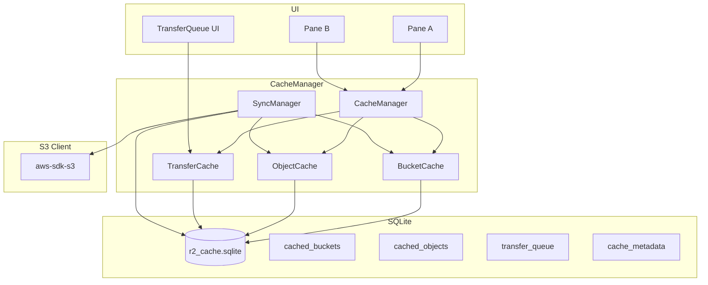
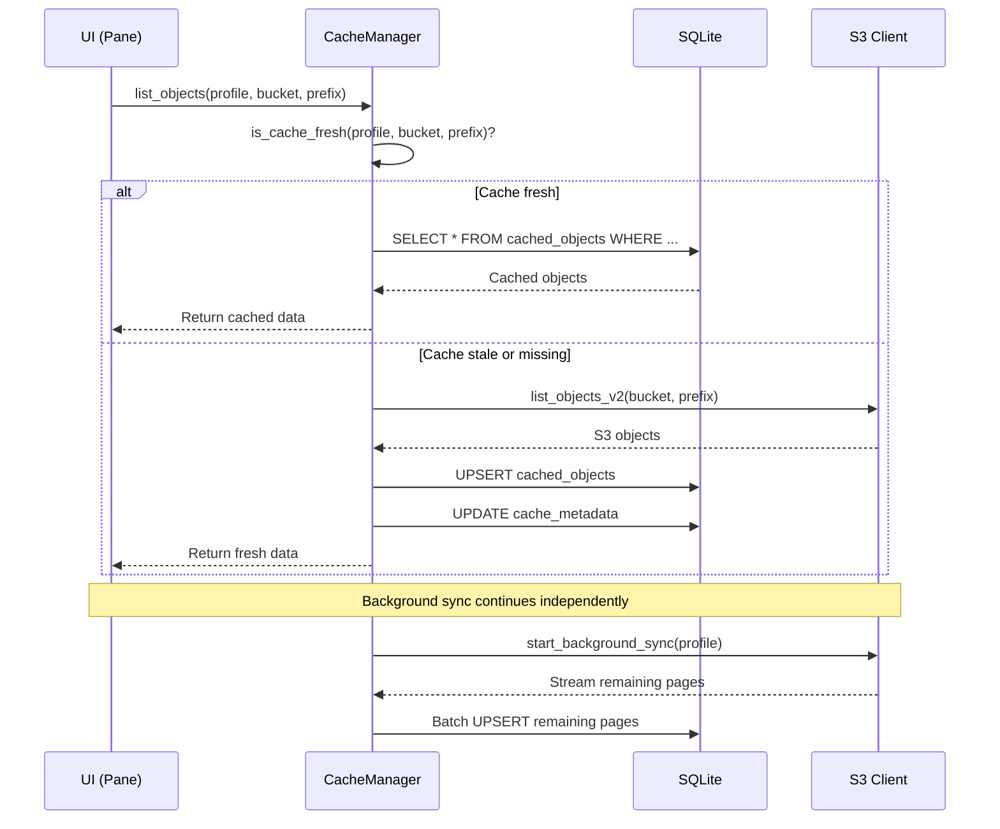

# ADR-004: Metadata-Cache mit SQLite

> **Status:** Accepted
> **Datum:** 2026-05-11
> **Kontext:** SRD S-04, NFR-PERF-01–06; UX_CONCEPTION Abschnitt 5.2

---

## Kontext

r2 benötigt einen lokalen Cache für S3-Metadaten, um:

- **Offline-Browsing:** Benutzer können Bucket-Strukturen ohne Netzwerk durchsuchen (UC-08, S-04.03)
- **Schnelle Navigation:** Objekt-Listen werden aus dem Cache geladen, während der Hintergrund-Sync aktualisiert (NFR-PERF-01)
- **Resume-Informationen:** Transfer-Queue-Status bleibt nach App-Neustart erhalten (NFR-REL-02)
- **Reduzierte API-Calls:** Nicht jeder List-Request geht zum S3-Endpunkt (Performance, Kosten)

Die Anforderungen umfassen:
- SQLite-Datenbank für Bucket-Strukturen (S-04.01)
- Cache wird bei erfolgreichem List/Refresh aktualisiert (S-04.02)
- Offline-Browsing: Anzeige der gecachten Struktur ohne Netzwerk (S-04.03)
- Sync-Status-Anzeige: visualisiert, welche Daten gecached vs. live sind (S-04.04)
- Cache-Read < 50ms für 10.000+ gecachte Objekte (NFR-PERF-06)

---

## Entscheidung

SQLite-Datenbank (via `rusqlite`) mit drei Haupttabellen: `cached_buckets`, `cached_objects`, `transfer_queue`. Der Cache wird asynchron im Hintergrund aktualisiert. TTL-basierte Invalidierung mit konfigurierbaren Intervallen.

### Datenbankschema

```sql
-- Tabelle: cached_buckets
CREATE TABLE cached_buckets (
    id INTEGER PRIMARY KEY AUTOINCREMENT,
    profile_id TEXT NOT NULL,
    bucket_name TEXT NOT NULL,
    creation_date TEXT,
    region TEXT,
    versioning_status TEXT,
    cached_at TEXT NOT NULL DEFAULT (datetime('now')),
    UNIQUE(profile_id, bucket_name)
);

-- Tabelle: cached_objects
CREATE TABLE cached_objects (
    id INTEGER PRIMARY KEY AUTOINCREMENT,
    profile_id TEXT NOT NULL,
    bucket_name TEXT NOT NULL,
    key TEXT NOT NULL,
    size INTEGER,
    etag TEXT,
    storage_class TEXT,
    last_modified TEXT,
    content_type TEXT,
    is_prefix BOOLEAN NOT NULL DEFAULT 0,
    cached_at TEXT NOT NULL DEFAULT (datetime('now')),
    UNIQUE(profile_id, bucket_name, key)
);

-- Index für schnelle Prefix-Suche
CREATE INDEX idx_objects_prefix
    ON cached_objects(profile_id, bucket_name, key);

-- Index für Bucket-Abfragen
CREATE INDEX idx_buckets_profile
    ON cached_buckets(profile_id);

-- Tabelle: transfer_queue (persistente Queue)
CREATE TABLE transfer_queue (
    id INTEGER PRIMARY KEY AUTOINCREMENT,
    source_profile_id TEXT,
    source_bucket TEXT,
    source_key TEXT,
    dest_profile_id TEXT,
    dest_bucket TEXT,
    dest_key TEXT,
    direction TEXT NOT NULL,
    total_bytes INTEGER,
    transferred_bytes INTEGER DEFAULT 0,
    status TEXT NOT NULL DEFAULT 'pending',
    priority INTEGER DEFAULT 0,
    error_message TEXT,
    created_at TEXT NOT NULL DEFAULT (datetime('now')),
    updated_at TEXT NOT NULL DEFAULT (datetime('now'))
);

-- Index für Queue-Abfragen
CREATE INDEX idx_queue_status
    ON transfer_queue(status);

-- Tabelle: cache_metadata (für Sync-Status)
CREATE TABLE cache_metadata (
    profile_id TEXT NOT NULL,
    bucket_name TEXT NOT NULL,
    prefix TEXT NOT NULL DEFAULT '',
    last_synced_at TEXT,
    is_full_sync BOOLEAN NOT NULL DEFAULT 0,
    object_count INTEGER DEFAULT 0,
    PRIMARY KEY (profile_id, bucket_name, prefix)
);
```

### Cache-Architektur



### Cache-Invalidierungsstrategie

| Cache-Typ | TTL | Invalidierung | Aktualisierung |
|-----------|-----|---------------|----------------|
| Bucket-Liste | 5 Minuten | Manueller Refresh | Hintergrund-Sync alle 5min |
| Objekt-Liste (Prefix) | 30 Sekunden | Nach Upload/Delete/Copy | Bei Navigation in Prefix |
| Objekt-Metadaten | 60 Sekunden | Nach Head-Request | Bei Selektion/Info-Panel |
| Transfer-Queue | Persistent | Bei Status-Änderung | Sofort (jede Änderung) |
| Cache-Metadaten | — | Bei Sync | Bei jedem Sync-Durchlauf |

### Sync-Manager

```rust
struct SyncManager {
    db: Arc<Mutex<Connection>>,
    s3_client: Arc<S3Client>,
    interval: Duration,  // Default: 5 Minuten
    active_syncs: Arc<DashMap<String, CancellationToken>>,
}

impl SyncManager {
    /// Hintergrund-Sync für ein Profil starten
    async fn start_background_sync(&self, profile_id: &str);

    /// Sofortigen Sync für einen bestimmten Prefix anstoßen
    async fn sync_prefix(&self, profile_id: &str, bucket: &str, prefix: &str);

    /// Cache für ein Profil komplett leeren
    async fn invalidate_profile(&self, profile_id: &str);

    /// Prüfen, ob Cache für einen Prefix aktuell ist
    fn is_cache_fresh(&self, profile_id: &str, bucket: &str, prefix: &str) -> bool;
}
```

### Cache-Read-Pfad



---

## Konsequenzen

### Positiv

- **Offline-Fähigkeit:** Vollständiges Browsing ohne Netzwerk möglich (UC-08)
- **Schnelle Navigation:** Objekt-Listen werden aus SQLite geladen (< 50ms für 10.000+ Objekte)
- **Reduzierte API-Costs:** Weniger List-Requests an S3-Endpunkte
- **Resume-Fähigkeit:** Transfer-Queue überlebt App-Neustart (NFR-REL-02)
- **Debugging:** SQLite-Datenbank kann mit `sqlite3` CLI oder DB Browser inspiziert werden
- **Transaktionssicherheit:** ACID-Garantien von SQLite verhindern korrupte Caches

### Negativ

- **Cache-Invalidierungs-Komplexität:** Die TTL-basierte Invalidierung muss sorgfältig abgestimmt sein — zu kurze TTLs machen den Cache nutzlos, zu lange TTLs zeigen veraltete Daten
- **Speicherplatz:** Bei 100.000 gecachten Objekten ca. 500 MB (NFR-RES-04)
- **Sync-Overhead:** Hintergrund-Sync verbraucht Bandbreite und CPU, auch wenn der Benutzer gerade nicht navigiert
- **Stale-Data-Risiko:** Wenn ein anderer Client (z.B. AWS Console) Objekte löscht, zeigt r2 diese noch bis zum nächsten Sync an

---

## Alternativen

### JSON-Dateien (pro Bucket/Prefix)

**Beschreibung:** Jeder Bucket/Prefix wird in einer eigenen JSON-Datei gecached.

**Verworfen, weil:**
- Keine Query-Möglichkeit — "Alle Objekte mit Storage-Class Glacier" erfordert Durchsuchen aller JSON-Dateien
- Keine atomaren Updates — bei Crash während des Schreibens ist die Datei korrupt
- Keine Transaktionen — inkonsistente Zustände zwischen Bucket-Cache und Object-Cache möglich
- Langsamer bei vielen Objekten — gesamte Datei muss geparst werden

### sled (embedded Key-Value Store)

**Beschreibung:** sled als embedded Key-Value-Datenbank für den Cache.

**Verworfen, weil:**
- Reine Key-Value-Datenbank — komplexe Queries sind umständlich (z.B. Prefix-Suche mit LIKE)
- Kein Standard-Tool zum Inspizieren der Datenbank während der Entwicklung
- Weniger erprobt für Cache-Anwendungsfälle mit TTL-basierter Invalidierung
- Keine Vorteile gegenüber SQLite für dieses Schema

### redb (embedded Key-Value Store)

**Beschreibung:** redb als Alternative zu sled.

**Verworfen, weil:**
- Noch relativ jung (3 Jahre) — Risiko von API-Änderungen
- Ebenfalls Key-Value — gleiche Einschränkungen wie sled
- Keine Vorteile gegenüber SQLite

---

## Implementierungshinweise

1. **WAL-Modus:** SQLite im WAL-Modus (Write-Ahead Logging) für bessere Concurrent-Read-Performance
2. **Connection-Pool:** Ein `Mutex<Connection>` pro Thread (oder `r2d2`-Pool) — SQLite ist single-writer
3. **Batch-Upserts:** Bei großen Buckets (> 1000 Objekte) werden UPSERTs in Batches von 500 ausgeführt
4. **Cache-Pfad:** `~/.config/r2/cache.sqlite` — im selben Verzeichnis wie die Config
5. **VACUUM:** Monatliches `VACUUM` oder bei Bedarf, um Speicherfragmentierung zu vermeiden
6. **Migration:** Schema-Version in `cache_metadata` für zukünftige Migrationen
7. **TTL-Konfiguration:** TTLs sind in der Config-Datei konfigurierbar (für Power-User)

---

> **Referenzen:** SRD S-04, NFR-PERF-01–06, NFR-REL-02, NFR-RES-04; UX_CONCEPTION 5.2
