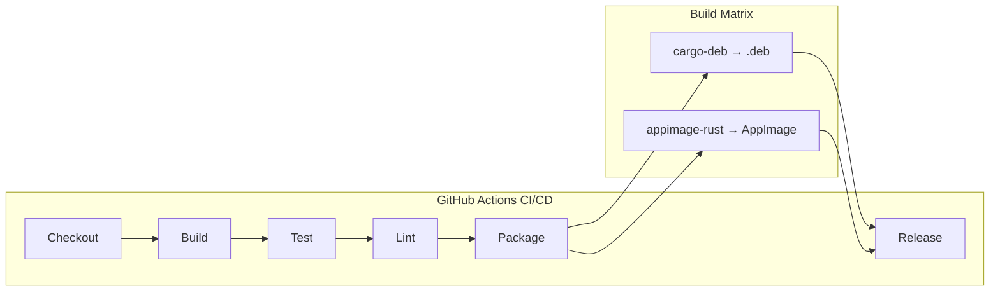

# ADR-005: Paketierung als .deb + AppImage

> **Status:** Accepted
> **Datum:** 2026-05-11
> **Kontext:** SRD Abschnitt 2.3, 9.3; NFR-COMPAT-03

---

## Kontext

r2 muss auf Ubuntu 22.04 LTS und neuer installierbar sein. Die Zielgruppe (Entwickler:innen, DevOps-Ingenieur:innen, Systemadministrator:innen) erwartet verschiedene Installationsmethoden:

- **.deb-Paket:** Für apt-basierte Systeme (primäre Distribution)
- **AppImage:** Für distributionunabhängige, portable Nutzung (sekundäre Distribution)
- **CI/CD:** Automatisierte Builds, Tests und Releases via GitHub Actions

Die Anforderungen umfassen:
- Ubuntu 22.04 LTS, 24.04 LTS als Zielplattform (NFR-COMPAT-03)
- Debian-Paket (.deb) für apt-basierte Systeme (SRD 2.3)
- AppImage für distributionunabhängige Nutzung (SRD 2.3)
- CI/CD: GitHub Actions für Build, Test, Lint, Package (NFR-MAINT-03)

---

## Entscheidung

Zwei Distributionsformate: (1) **.deb** via `cargo-deb` für apt-Installation, (2) **AppImage** via `appimage-rust` für portable Nutzung. CI/CD via GitHub Actions mit Matrix-Build für beide Formate.

### Build-Pipeline



### .deb-Paket (cargo-deb)

**Konfiguration in `Cargo.toml`:**

```toml
[package.metadata.deb]
name = "r2"
section = "net"
priority = "optional"
maintainer = "r2 Team <dev@r2.app>"
depends = "libgtk-4-1 (>= 4.14), libsecret-1-0 (>= 0.20), libsqlite3-0 (>= 3.40)"
recommends = "libadwaita-1-0 (>= 1.6)"
conflicts = "r2-bin"
replaces = "r2-bin"

[package.metadata.deb.variants.ubuntu-jammy]
depends = "libgtk-4-1 (>= 4.8), libsecret-1-0 (>= 0.20), libsqlite3-0 (>= 3.37)"

[package.metadata.deb.variants.ubuntu-noble]
depends = "libgtk-4-1 (>= 4.14), libsecret-1-0 (>= 0.20), libsqlite3-0 (>= 3.40)"
```

**Assets für .deb:**

```
.deb-Paket-Inhalt:
├── usr/
│   ├── bin/
│   │   └── r2                    # Kompilierte Binary
│   ├── lib/
│   │   └── r2/
│   │       └── icons/            # App-Icons (SVG, PNG)
│   └── share/
│       ├── applications/
│       │   └── r2.desktop        # .desktop-Datei
│       ├── metainfo/
│       │   └── r2.metainfo.xml   # AppStream-Metadaten
│       ├── icons/
│       │   └── hicolor/
│       │       ├── 16x16/apps/r2.png
│       │       ├── 32x32/apps/r2.png
│       │       ├── 48x48/apps/r2.png
│       │       ├── 64x64/apps/r2.png
│       │       ├── 128x128/apps/r2.png
│       │       └── scalable/apps/r2.svg
│       └── doc/r2/
│           ├── README.md
│           └── changelog.gz
└── etc/
    └── apparmor.d/
        └── usr.bin.r2            # AppArmor-Profil (optional)
```

### AppImage (appimage-rust)

**Konfiguration:**

```yaml
# appimage.yml
version: 1
AppDir:
  path: ./AppDir
  app_info:
    id: com.r2.app
    name: r2
    icon: r2
    version: 0.1.0
    exec: usr/bin/r2
  apt:
    arch: amd64
    sources:
      - sourceline: 'deb http://archive.ubuntu.com/ubuntu/ noble main universe'
    include:
      - libgtk-4-1
      - libsecret-1-0
      - libsqlite3-0
      - libadwaita-1-0
      - libpango-1.0-0
      - libcairo2
      - libglib2.0-0
  files:
    include:
      - /usr/bin/r2
    exclude:
      - usr/share/man
      - usr/share/doc
  test:
    - ./r2 --help
```

### GitHub Actions CI/CD

```yaml
# .github/workflows/ci.yml
name: CI/CD

on:
  push:
    branches: [main, develop]
  pull_request:
    branches: [main]
  release:
    types: [published]

jobs:
  build:
    runs-on: ubuntu-22.04
    strategy:
      matrix:
        target: [x86_64-unknown-linux-gnu]
        profile: [release]

    steps:
      - uses: actions/checkout@v4

      - name: Install Rust
        uses: dtolnay/rust-toolchain@stable
        with:
          targets: ${{ matrix.target }}

      - name: Install system dependencies
        run: |
          sudo apt-get update
          sudo apt-get install -y \
            libgtk-4-dev libsecret-1-dev libsqlite3-dev \
            libadwaita-1-dev libappindicator3-dev

      - name: Cache Cargo dependencies
        uses: Swatinem/rust-cache@v2

      - name: Build
        run: cargo build --profile ${{ matrix.profile }}

      - name: Test
        run: cargo test --profile ${{ matrix.profile }}

      - name: Lint
        run: |
          cargo clippy -- -D warnings
          cargo fmt --check

      - name: Build .deb package
        run: cargo deb --profile ${{ matrix.profile }}

      - name: Build AppImage
        run: |
          cargo build --profile ${{ matrix.profile }}
          appimage-builder --recipe appimage.yml

      - name: Upload artifacts
        uses: actions/upload-artifact@v4
        with:
          name: r2-${{ matrix.target }}
          path: |
            target/debian/*.deb
            r2-*.AppImage

      - name: Release
        if: github.event_name == 'release'
        uses: softprops/action-gh-release@v2
        with:
          files: |
            target/debian/*.deb
            r2-*.AppImage
```

### .desktop-Datei

```desktop
[Desktop Entry]
Name=r2
Comment=S3-kompatibler Object-Storage-Browser
Exec=r2 %F
Icon=r2
Terminal=false
Type=Application
Categories=Network;FileTransfer;GTK;
StartupNotify=true
MimeType=x-scheme-handler/s3;
```

### AppStream-Metadaten

```xml
<?xml version="1.0" encoding="UTF-8"?>
<component type="desktop-application">
  <id>com.r2.app</id>
  <name>r2</name>
  <summary>S3-kompatibler Object-Storage-Browser</summary>
  <description>
    <p>r2 ist ein nativer Desktop-Client für Ubuntu Linux, der als grafischer
    S3-kompatibler Object-Storage-Browser fungiert. Das Produkt richtet sich
    an Entwickler:innen, DevOps-Ingenieur:innen und Systemadministrator:innen,
    die regelmäßig mit S3-kompatiblen Speicherdiensten arbeiten.</p>
  </description>
  <categories>
    <category>Network</category>
    <category>FileTransfer</category>
  </categories>
  <url type="homepage">https://r2.app</url>
  <url type="bugtracker">https://github.com/r2/r2/issues</url>
  <project_license>MIT</project_license>
  <metadata_license>CC0-1.0</metadata_license>
  <releases>
    <release version="0.1.0" date="2026-05-11"/>
  </releases>
  <requires>
    <display_length compare="ge">720</display_length>
  </requires>
  <recommends>
    <control>keyboard</control>
    <control>pointing</control>
  </recommends>
  <launchable type="desktop-id">r2.desktop</launchable>
</component>
```

---

## Konsequenzen

### Positiv

- **Breite Abdeckung:** .deb für Ubuntu-Benutzer, AppImage für alle anderen Distributionen
- **Einfache Installation:** .deb via `sudo apt install ./r2.deb` oder Doppelklick
- **Portable Nutzung:** AppImage ohne Installation — ideal für CI/CD-Umgebungen und Test-Setups
- **Automatisierte Releases:** GitHub Actions baut, testet und veröffentlicht beide Formate
- **AppStream-Integration:** r2 erscheint in GNOME Software / KDE Discover
- **Desktop-Integration:** .desktop-Datei für Menü-Eintrag, MIME-Type für s3://-Links

### Negativ

- **Zwei Build-Pipelines:** .deb und AppImage haben unterschiedliche Build-Prozesse
- **AppImage-Größe:** Enthält gebündelte GTK4-Bibliotheken → größer als .deb (~50-80 MB vs. ~5-10 MB)
- **Ubuntu-Versionen:** Unterschiedliche GTK4-Versionen in Ubuntu 22.04 (4.8) vs. 24.04 (4.14) erfordern Varianten
- **AppArmor:** Optionales Profil für zusätzliche Sicherheit, aber nicht zwingend erforderlich

---

## Alternativen

### Snap

**Beschreibung:** Snap-Paket über den Snap Store.

**Verworfen, weil:**
- Zu restriktiv — Snap-Sandboxing schränkt Dateisystemzugriff und D-Bus-Kommunikation ein
- GTK4-Snap ist nicht standardmäßig auf Ubuntu 22.04 installiert
- AppImage bietet mehr Flexibilität für Power-User
- Snap-Store erfordert zusätzliche Registrierung und Review-Prozess

### Flatpak

**Beschreibung:** Flatpak-Paket über Flathub.

**Verworfen, weil:**
- Erfordert zusätzliche Runtime-Dependency (org.gnome.Platform)
- Nicht standardmäßig auf Ubuntu installiert (Benutzer muss Flatpak erst einrichten)
- Größerer Download (~200 MB Runtime + ~50 MB App)
- Höherer Wartungsaufwand für Flatpak-Manifest

### Nur .deb (kein AppImage)

**Beschreibung:** Ausschließliche Distribution als .deb-Paket.

**Verworfen, weil:**
- Schließt Nicht-Ubuntu-Benutzer aus (Fedora, Arch, openSUSE)
- Keine portable Nutzung möglich (USB-Stick, CI/CD)
- Widerspricht SRD 2.3 (sekundäre Distribution als AppImage)

---

## Implementierungshinweise

1. **cargo-deb-Konfiguration:** In `Cargo.toml` unter `[package.metadata.deb]` — unterstützt Varianten für verschiedene Ubuntu-Versionen
2. **appimage-rust:** Nutzt `appimage-builder` mit einer YAML-Recipe-Datei — bindet fehlende Systembibliotheken ein
3. **CI/CD-Caching:** `Swatinem/rust-cache` für Cargo-Dependency-Caching — reduziert Build-Zeit von 30min auf 5min
4. **Signierung:** .deb-Pakete mit GPG signieren (via `debsigs`); AppImage mit `appimagetool --sign`
5. **Versionierung:** Semantische Versionierung (SemVer) — Git-Tags triggern Releases
6. **Changelog:** Automatisch aus Git-Commits generiert (via `git-cliff` oder `cargo-release`)

---

> **Referenzen:** SRD 2.3, 9.3, NFR-COMPAT-03, NFR-MAINT-03
